[TOC]

# 平衡车

> **平衡车原理图**
>
> 

# 零、项目总览与PID调用手册（快速索引）

> 阅读本文档前先看这里，快速理解整个项目结构和 PID 调用关系。

---

## 项目文件结构

```
E:\codex\test\balance_car\balance_car\
├── user/                          ← 应用层（你要改的都在这里）
│   ├── main.c                     → 主循环：Init → while(1) 轮询 Proc
│   ├── app_control.c/h            → ★ 核心：平衡控制（三环串级PID + 逆解算 + 转向）
│   ├── app_motor.c/h              → 电机转速闭环（左右PI控制器 → PWM）
│   ├── app_mpu6050.c/h            → MPU6050/6500 驱动 + 互补滤波 → 欧拉角
│   ├── app_encoder.c/h            → 编码器 T法测速
│   ├── app_pwm.c/h                → TIM1 PWM 输出（TB6612 驱动）
│   ├── app_bat.c/h                → ADC 电池电压 + 电量指示灯
│   ├── app_button.c/h             → 按钮：双击切换电机开关
│   ├── app_rc.c/h                 → 遥控器串口指令 "move turnSpeed moveSpeed"
│   ├── app_usart2.c/h             → 调试串口
│   └── stm32f10x_conf.h           → 外设头文件汇总
│
├── my_lib/                        ← 通用库（跨项目复用）
│   ├── pid.c/h                    → ★ PID 控制器（位置式）
│   ├── task.h                     → PERIODIC 宏（时间切片）
│   ├── button.c/h                 → 按钮驱动（消抖 + 回调）
│   ├── delay.c/h                  → GetTick() / GetUs()
│   ├── qmath.c/h                  → 快速三角函数（qsin/qcos/qatan）
│   └── i2c/si2c/spi/oled/usart... → 底层驱动
│
└── std_periph_driver/             ← STM32F10x 标准外设库（不动）
```

---

## 主循环执行流程（main.c）

```
main()
  │
  ├─ App_USART2_Init()        调试串口
  ├─ App_Button_Init()        按钮（双击开关电机）
  ├─ App_Encoder_Init()       编码器（TIM4 正交解码）
  ├─ App_PWM_Init()           TIM1 四路 PWM
  ├─ App_Bat_Init()           ADC + TIM2 TRGO 触发
  ├─ App_Motor_Init()         左右电机 PI 速度环
  ├─ App_MPU6050_Init()       I2C 初始化 + 量程配置
  ├─ App_Control_Init()       ★ 三环串级 PID + 转向环
  ├─ App_RC_Init()            遥控器串口
  │
  └─ while(1)
       ├─ App_Bat_Proc()         每 10ms ADC 中断自动采集
       ├─ App_Button_Proc()      按钮轮询
       ├─ App_Motor_Proc()       PERIODIC(1ms) 电机转速 PI → PWM
       ├─ App_MPU6050_Proc()     PERIODIC(5000μs) 互补滤波
       ├─ App_Control_Proc()     PERIODIC(5ms) ★ 三环串级控制
       └─ App_RC_Proc()          串口指令解析
```

---

## PID 结构全景：五层嵌套控制

```
 遥控器 move X Y  ───→  设定速度 ẋ_ref
                              │
    ┌─────────────────────────▼─────────────────────────────┐
    │                                                       │
    │              【第1层】速度环 pid_velocity              │
    │              输入：ẋ_ref（编码器→补偿后x_dot）         │
    │              输出：θ_ref（预期倾角）                   │
    │              公式：θ_ref = atan( PID(ẋ_err) / g )      │
    │              控制器：PI  频率：随 5ms 主循环           │
    │              ★ 已补偿轮胎后撤效应                      │
    └─────────────────────────┬─────────────────────────────┘
                              │ θ_ref
    ┌─────────────────────────▼─────────────────────────────┐
    │                                                       │
    │              【第2层】角度环 pid_theta                 │
    │              输入：θ_ref，反馈：MPU6050 pitch (互补滤波)│
    │              输出：θ̇_ref（预期角速度）                  │
    │              控制器：P  带宽 ≈ 2~5 rad/s               │
    └─────────────────────────┬─────────────────────────────┘
                              │ θ̇_ref
    ┌─────────────────────────▼─────────────────────────────┐
    │                                                       │
    │              【第3层】角速度环 pid_theta_dot           │
    │              输入：θ̇_ref，反馈：MPU6050 Gx             │
    │              输出：θ̈_ref（预期角加速度）               │
    │              控制器：PI  带宽 ≈ 10~20 rad/s            │
    └─────────────────────────┬─────────────────────────────┘
                              │ θ̈_ref
    ┌─────────────────────────▼─────────────────────────────┐
    │                                                       │
    │              【逆解算】倒立摆非线性消除                 │
    │              ẍ_ref = (g·sinθ - θ̈_ref·lp) / cosθ        │
    │              积分得 ω_ref（电机目标转速）              │
    └──────────────┬──────────────────┬─────────────────────┘
                   │                  │
    ┌──────────────▼─────┐    ┌──────▼──────────────┐
    │                    │    │                      │
    │【转向环】pid_turn  │    │    ω_ref ± ω_diff   │
    │反馈：MPU6050 Gz    │    │          │           │
    │控制器：P           │    │          │           │
    │输出：ω_diff        │    │          │           │
    └────────────────────┘    └──────────┬───────────┘
                                        │
    ┌───────────────────┬───────────────┴───────────────────┐
    │                   │                                   │
    │  【第4层】        │          【第4层】                │
    │  pid_motor_l      │          pid_motor_r              │
    │  左电机PI速度环    │          右电机PI速度环            │
    │  反馈：编码器      │          反馈：编码器              │
    │  输出：PWM_L       │          输出：PWM_R              │
    │  频率：1ms         │          频率：1ms                │
    └───────────────────┴───────────────────────────────────┘
                                        │
                                   TB6612 → 电机
```

---

## PID 控制器速查表（所有5个PID实例的参数）

| PID 实例        | 文件位置         | 类型 | Kp   | Ki   | Kd   | 输出上限    | 频率 | 作用            |
| :-------------- | :--------------- | :--- | :--- | :--- | :--- | :---------- | :--- | :-------------- |
| `pid_velocity`  | app_control.c:22 | PI   | 10   | 1    | 0    | ±0.5g m/s²  | 5ms  | 速度→倾角       |
| `pid_theta`     | app_control.c:23 | P    | 4    | 0    | 0    | ±4π rad/s   | 5ms  | 倾角→角速度     |
| `pid_theta_dot` | app_control.c:24 | PI   | 10   | 10   | 0    | ±40π rad/s² | 5ms  | 角速度→角加速度 |
| `pid_turn`      | app_control.c:25 | P    | 1    | 0    | 0    | ±15 rad/s   | 5ms  | 陀螺仪Z轴→差速  |
| `pid_motor_l`   | app_motor.c:9    | PI   | 0.5  | 7    | 0    | ±8.4V       | 1ms  | 转速→PWM(左)    |
| `pid_motor_r`   | app_motor.c:10   | PI   | 0.5  | 7    | 0    | ±8.4V       | 1ms  | 转速→PWM(右)    |

---

## PID 代码如何调用（按需查阅）

### 1. 初始化一个PID

```c
#include "pid.h"

PID_TypeDef my_pid;

// Init: 设置 Kp, Ki, Kd
PID_Init(&my_pid, 10.0f, 1.0f, 0.0f);

// 设置输出限幅
PID_LimitConfig(&my_pid, +100.0f, -100.0f);

// 设置设定值
PID_ChangeSP(&my_pid, 0.0f);
```

### 2. 主循环中计算

```c
float sensor_value = read_sensor();
float output = PID_Compute(&my_pid, sensor_value);
// output 就是控制量，直接拿去驱动执行器
```

### 3. 切换模式时复位

```c
PID_Reset(&my_pid);        // 清零历史值，避免切换时突变
PID_ChangeSP(&my_pid, 0);  // 切换到新设定值
```

### 4. PID 内部算法（pid.c）

```
err = SP - FB
deltaT = (GetUs() - t_k_1) × 1e-6          ← 精确到微秒
err_dev = (err - err_k_1) / deltaT
err_int = err_int_k_1 + (err + err_k_1)/2 × deltaT   ← 梯形积分

CO = Kp×err + Ki×err_int + Kd×err_dev

→ 输出限幅（CO）
→ 积分限幅（err_int_k_1）
```

---

## PERIODIC 宏用法（task.h）

```c
// 简单版（一个函数一个周期任务）
void MyProc(void) {
    PERIODIC(5)  // 每 5ms 执行一次，否则直接 return
    // 你的代码...
}

// 命名版（一个函数多个周期任务，互不干扰）
void MyProc(void) {
    PERIODIC_START(fast, 1);   // 每 1ms
        // 快任务...
    PERIODIC_END

    PERIODIC_START(slow, 10);  // 每 10ms
        // 慢任务...
    PERIODIC_END
}
```

---

## 快速查找指南

| 你想...           | 去看                                        |
| :---------------- | :------------------------------------------ |
| 改 PID 参数       | `app_control.c` 的 `App_Control_Init()`     |
| 改电机响应        | `app_motor.c` 的 `App_Motor_Init()`         |
| 加新的 PID 环     | 照抄 `pid_theta` 声明 → Init → Compute 模式 |
| 理解 PID 底层实现 | `my_lib/pid.c`                              |
| 理解控制理论      | 本文档 第五章（PID建模+传递函数+波特图）    |
| 理解倒立摆逆解算  | 本文档 第六章 6.1~6.5                       |
| 理解速度环悖论    | 本文档 第七章 7.1~7.2                       |
| 改传感器逻辑      | `app_mpu6050.c` + `app_encoder.c`           |
| 改控制频率        | 改 `PERIODIC(5)` 里的数字                   |
| 添加遥控指令      | `app_rc.c` 的 `App_RC_Proc()`               |

# 一、ADC采集电压

## 1.1.【电池】使用ADC采集电池电压

### **前置知识：**

将连续变化的**模拟信号**（如电压、电流、温度传感器输出的模拟量）转换为**离散的数字量**（如0~4095的整数），使数字系统（单片机、DSP、FPGA）能够读取、计算、存储和控制。**ADC转换**：将这个电压映射成一个数字，例如 `0 → 0V`，`2048 → 1.65V`，`4095 → 3.3V`。

**STM32 ADC 主要特性（以常见F1/F4系列为例）**

- **分辨率**：12位（可配置为10/8/6位，加快转换）
- **多个ADC**：最多3个独立ADC（ADC1、ADC2、ADC3），可实现同步/交替采样
- **通道数**：最多16个外部通道 + 内部通道（温度传感器、Vrefint、VBAT等）
- **转换模式**：单次、连续、扫描、间断模式
- **触发源**：软件触发、定时器触发（TIM1/2/3/4/5/8等）、外部引脚触发
- **数据对齐**：左对齐 / 右对齐
- **双重/三重ADC模式**：同步注入、交替规则、交替触发等
- **DMA支持**：规则组转换结果可自动传输到内存
- **注入组**：高优先级，最多4个通道，有独立的数据寄存器

### 本次ADC采集流程：

1. **系统上电 → 调用 `App_Bat_Init()` 完成所有配置。**
2. **定时器2 自由运行，每10ms产生更新事件 → 输出TRGO脉冲。**
3. **每个TRGO脉冲 立即触发一次注入转换：**
	- **ADC从通道8（PB0）采样电压，采样持续1.5个ADC时钟（125ns）。**
	- **逐次逼近转换（12位，需约12~14个时钟周期，总时间 < 2μs）。**
4. **转换完成后硬件置位 `JEOC` 标志，并 触发中断。**
5. **中断服务程序读取 `JDR1` 寄存器，得到12位数字量（0~4095），换算后存储或发送。**
6. **准备下一次触发，周而复始。**

> 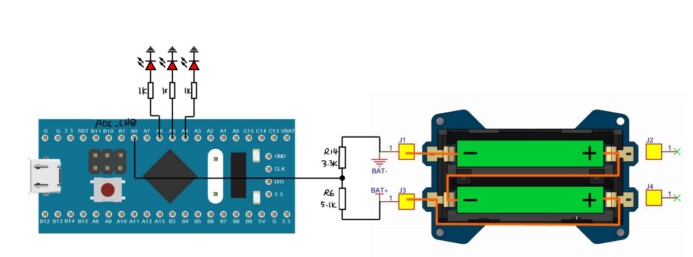
>
> **因为单片机最大测量电压为 3.3V，所以实际测试的时候采用电阻分压再计算的测量模式。**

> **==时钟树与ADC内部框图==**
>
> ==**本次项目使用注入组,通过TIM2的TRGO每10ms产生脉冲信号触发ADC**==
>
> 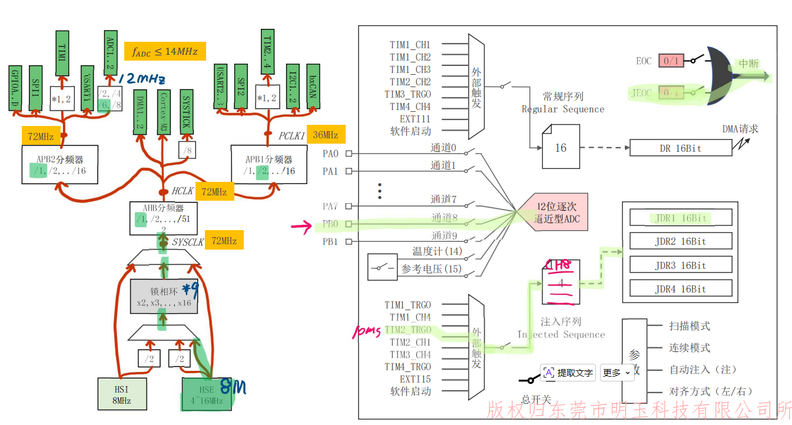
>
> ==**常规序列与注入序列区别:**==
>
> | **对比项**     | **规则组**           | **注入组**                   |
> | :------------- | :------------------- | :--------------------------- |
> | **优先级**     | **低**               | **高（可打断规则组）**       |
> | **最大通道数** | **16**               | **4**                        |
> | **结果寄存器** | **1个（DR）**        | **4个（JDR1~4）**            |
> | **DMA支持**    | **支持**             | **不支持**                   |
> | **典型用途**   | **周期性多通道扫描** | **突发、高优先级、少量通道** |
> | **自动启动**   | **无**               | **可规则组结束后自动注入**   |
> | **中断标志**   | **EOC**              | **JEOC**                     |
>
> ==**流程图:**==
>
> 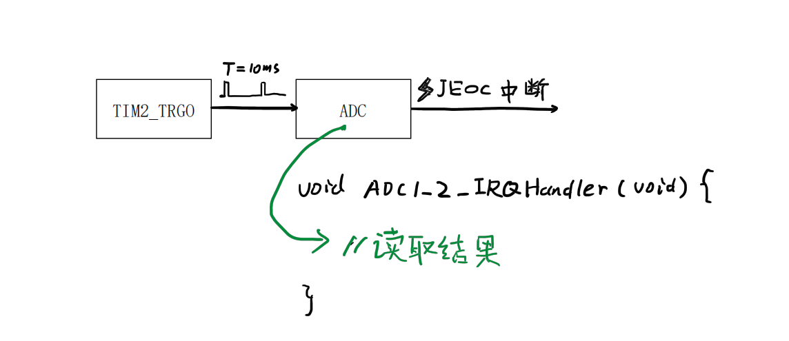
>
> 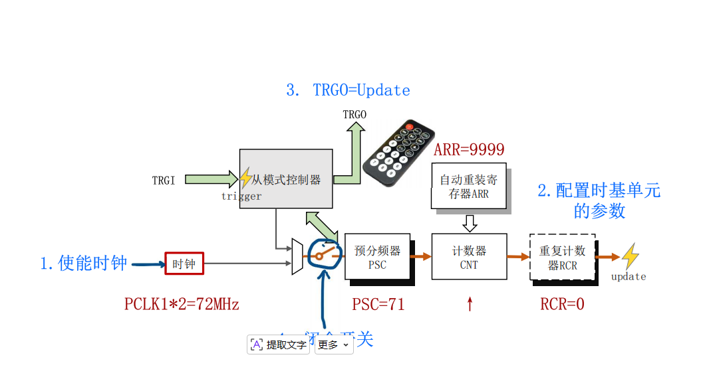
>
> ==**定时器二的配置：**==
>
> - **定时器2每10ms产生一次更新事件（ `TIM_Period = 9999`， `TIM_Prescaler = 71`，若系统时钟为72MHz → 定时器时钟72MHz，分频72得1MHz，周期10000 → 10ms）。**
> - **每次更新事件输出到TRGO，触发ADC1的注入组进行单次转换。**
> - **注入组转换完成后产生 JEOC（注入转换结束）中断，在中断中读取结果。**

#### ==**采样时间的计算:**==

```c
	// 设置注入序列的参数
	ADC_ExternalTrigInjectedConvConfig(ADC1, ADC_ExternalTrigInjecConv_T2_TRGO); // 把定时器2的TRGO作为注入序列的外部触发
	ADC_ExternalTrigInjectedConvCmd(ADC1, ENABLE); // 闭合外部触发开关
	ADC_InjectedChannelConfig(ADC1, ADC_Channel_8, 1, ADC_SampleTime_1Cycles5);//采样 1.5 个 ADC 时钟周期
```

> 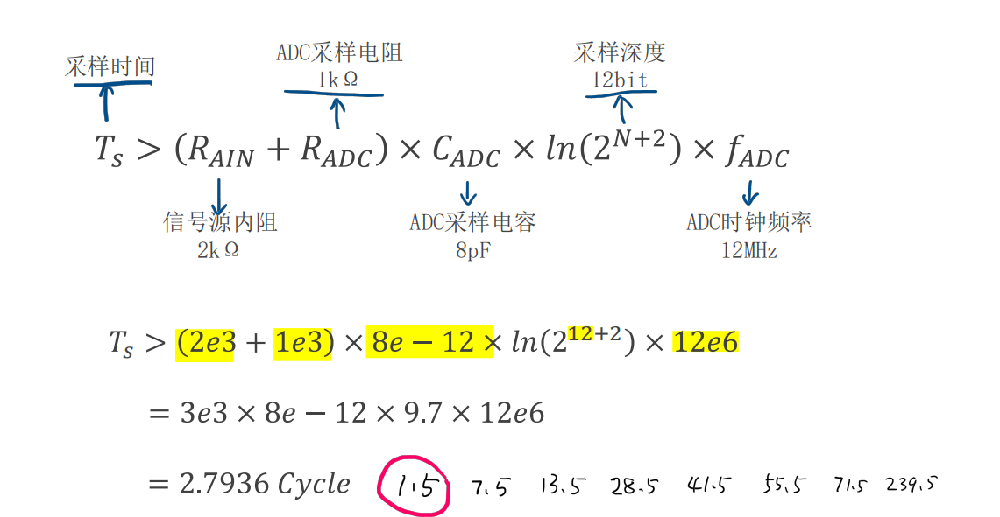
>
> 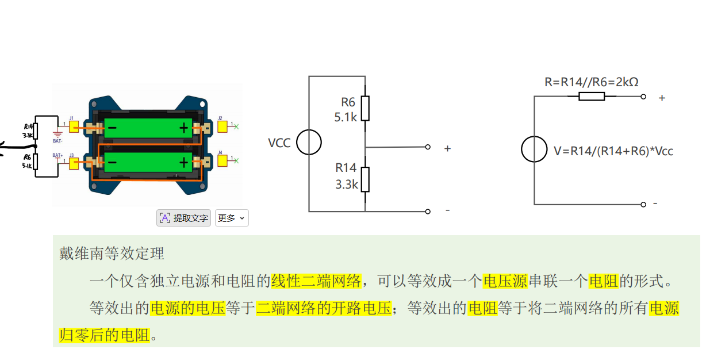
>
> 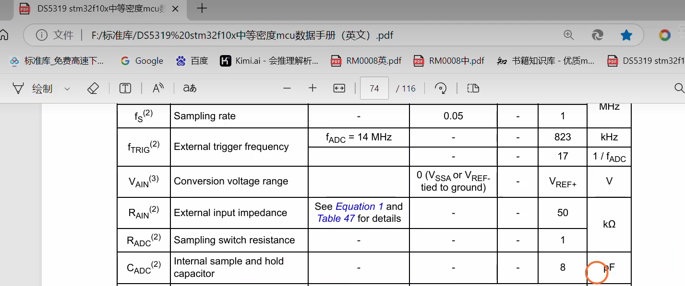

### **最终采集的电压：**

> 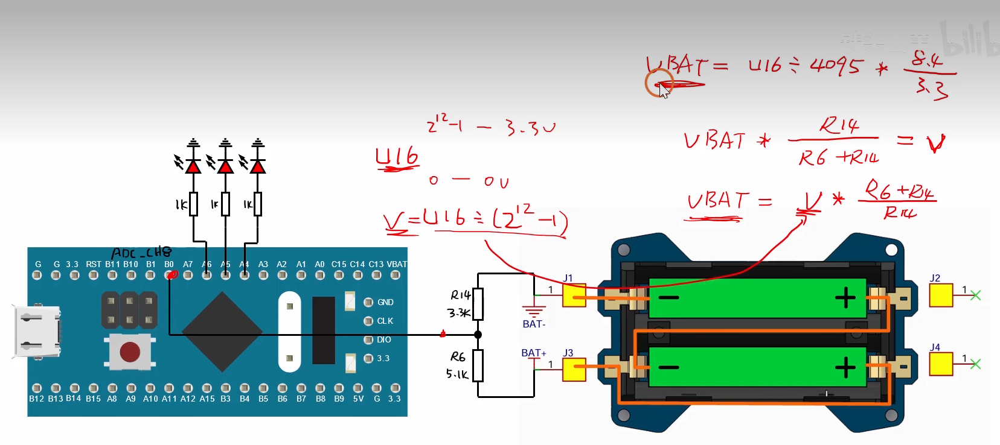
>
> ```c
>  uint16_t jdr1 = ADC_GetInjectedConversionValue(ADC1, ADC_InjectedChannel_1);
>  vbat = jdr1 / 4095.0f *3.3 * 8.4f / 3.3;
> ```
>
> 

> ==**通过串口2作为平衡车的调试接口**==
>
> 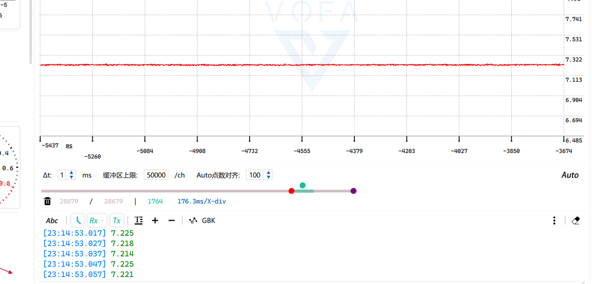


## 1.2【电池】裸机多任务模型和电源指示灯

### **前置知识：**

**在嵌入式开发中，裸机多任务模型指的是在没有操作系统（RTOS）的情况下，通过软件设计模拟多任务并发执行。它的核心思想是：CPU 宏观上看似同时处理多个任务，微观上仍是单线程顺序执行，依靠任务切换来共享处理器时间。**

**一个典型的裸机多任务模型包含三个基本部分：**

- **任务（Task）：每个任务是独立的功能函数，拥有自己的执行上下文（主要是栈空间和程序计数器）。**
- **任务控制块（TCB）：记录任务的状态（就绪、运行、挂起等）、栈指针、任务入口等。**
- **调度器（Scheduler）：决定下一个执行哪个任务，通常采用时间片轮询或优先级抢占策略。**

> ```c
> ┌─────────────────────────────────────┐
> │            应用层任务                 │
> │   Task1    Task2    Task3    Task4   │
> └────┬────────┬────────┬────────┬─────┘
>      │        │        │        │
> ┌────▼────────▼────────▼────────▼─────┐
> │          调度器 (Scheduler)          │
> │   就绪队列 │ 优先级管理 │ 时间片     │
> └────────────────┬────────────────────┘
>                  │
> ┌────────────────▼────────────────────┐
> │         裸机硬件 (Bare Metal)        │
> │   CPU │ RAM │ 定时器 │ 中断控制器    │
> └─────────────────────────────────────┘
> 
> ```

> 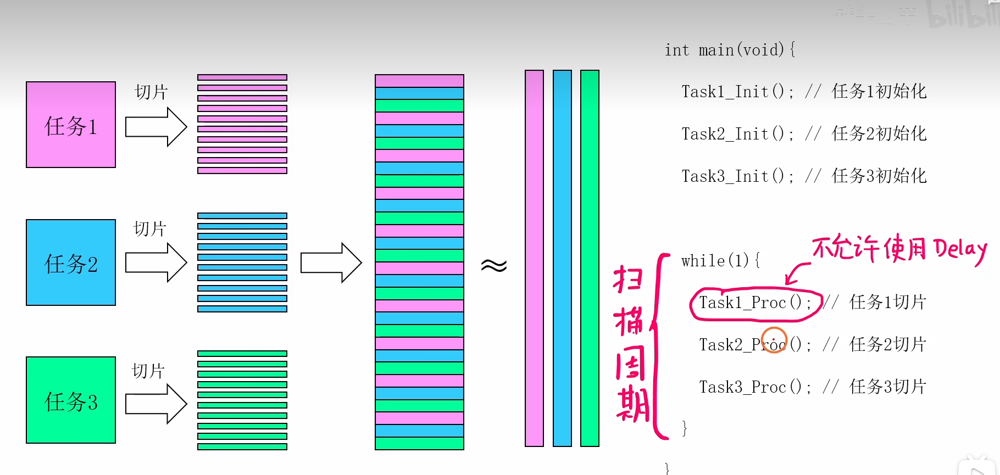
>
> ==**直观的例子:**==
>
> 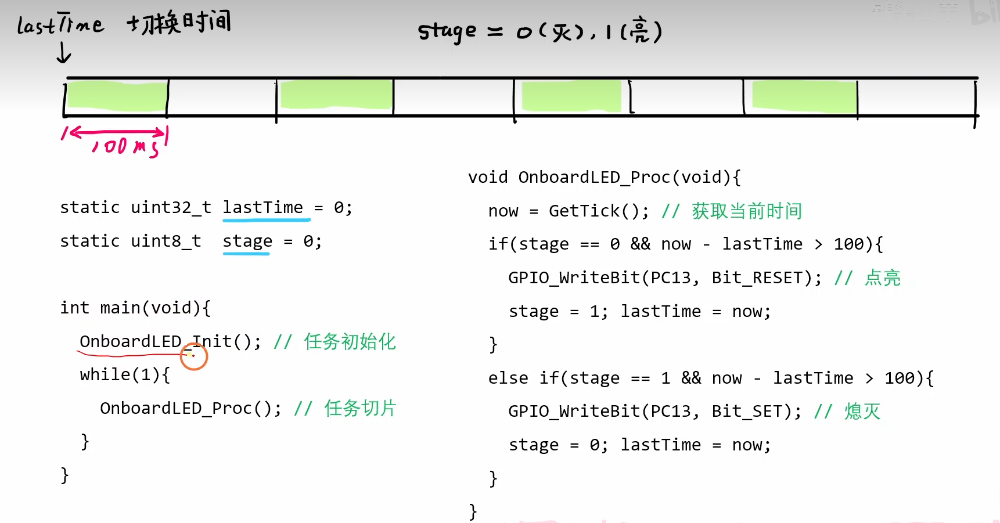

**通过切片的方式，来实现裸机下的多个程序的运行，千万不能用 delay，延迟的时间无法让**

**PID 进行迅速的反馈调节，PID 的循环执行大概在 1-2ms。**

==**电源指示灯代码**==

> ```c
> void App_Bat_Proc(void)
> {
> 	if(vbat > 7.9) // 电池满电，点亮3颗
> 	{
> 		GPIO_WriteBit(GPIOA, GPIO_Pin_4, Bit_SET);
> 		GPIO_WriteBit(GPIOA, GPIO_Pin_5, Bit_SET);
> 		GPIO_WriteBit(GPIOA, GPIO_Pin_6, Bit_SET);
> 	}
> 	else if(vbat > 7.4) // 75%，点亮2颗
> 	{
> 		GPIO_WriteBit(GPIOA, GPIO_Pin_4, Bit_SET);
> 		GPIO_WriteBit(GPIOA, GPIO_Pin_5, Bit_SET);
> 		GPIO_WriteBit(GPIOA, GPIO_Pin_6, Bit_RESET);
> 	}
> 	else if(vbat > 7) // 50%，点亮1颗
> 	{
> 		GPIO_WriteBit(GPIOA, GPIO_Pin_4, Bit_SET);
> 		GPIO_WriteBit(GPIOA, GPIO_Pin_5, Bit_RESET);
> 		GPIO_WriteBit(GPIOA, GPIO_Pin_6, Bit_RESET);
> 	}
> 	else if(vbat > 6.5) // 20%，全部熄灭
> 	{
> 		GPIO_WriteBit(GPIOA, GPIO_Pin_4, Bit_RESET);
> 		GPIO_WriteBit(GPIOA, GPIO_Pin_5, Bit_RESET);
> 		GPIO_WriteBit(GPIOA, GPIO_Pin_6, Bit_RESET);
> 	}
> 	else
> 	{
> 		uint32_t now = GetTick();
> 		
> 		if(now - lastTime > 100)
> 		{
> 			switch(stage)
> 			{
> 				case 0: // 当前熄灭
> 				{
>           GPIO_WriteBit(GPIOA, GPIO_Pin_4 | GPIO_Pin_5 | GPIO_Pin_6, Bit_SET); // 点亮					
> 					stage = 1;
> 					
> 					break;
> 				}
> 				case 1: // 当前点亮
> 				{
> 					GPIO_WriteBit(GPIOA, GPIO_Pin_4 | GPIO_Pin_5 | GPIO_Pin_6, Bit_RESET); // 熄灭					
> 					stage = 0;
> 					break;
> 				}
> 			}
> 			
> 			lastTime = now;
> 		}
> 	}
> }
> ```

# 二、电机调速原理

## 2.1【电机】电机调速原理

### **前置知识:**

#### 电机控制模型详解：从有刷直流到无刷与 FOC

**从 TB6612 驱动的有刷直流电机到复杂的无刷电机和 FOC 算法，是控制模型从电压直接控制向磁场精确解耦的演进过程。本文逐步介绍有刷直流电机、无刷直流电机（BLDC）、永磁同步电机（PMSM）的原理及核心控制算法。**

---

#### 一、有刷直流电机的控制模型

**这是使用 TB6612 等 H 桥驱动芯片控制的电机类型，控制模型最为基础。**

##### 1. 工作原理与等效电路

**内部包含永磁体定子、线圈转子（电枢）、换向器和碳刷。碳刷与换向器利用机械接触自动切换转子线圈电流方向，使转子在定子磁场中持续旋转。**

**电气等效模型可视为一个电阻、一个电感和一个与转速成正比的“发电机”串联。**

##### 2. 数学模型（核心方程）

**控制模型由两个核心方程描述：**

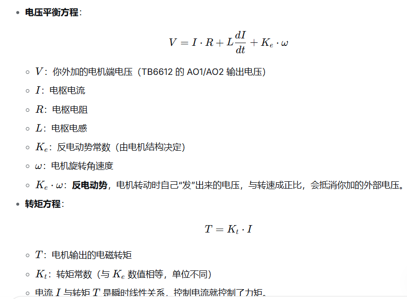

##### 3. 调速方法与 TB6612 控制

- **调电压 = 调转速：稳态时 \( V ≈ I · R + Ke · ω)，负载一定时，外加电压越高转速越高。TB6612 的 PWMA 引脚输入 PWM 正是调节平均电压实现调速。**
- **H 桥实现正反转与制动：**
  - **正转：AIN1=1, AIN2=0 → 电流从 AO1 流向 AO2**
  - **反转：AIN1=0, AIN2=1 → 电流从 AO2 流向 AO1**
  - **刹车：AIN1=1, AIN2=1 → AO1 与 AO2 短接到地，动能消耗在电阻上**
- **闭环控制：加装编码器等传感器，通过 PID 控制器 实现速度或位置闭环：期望值与实际值做差 → PID 输出 PWM 占空比 → 驱动电机。**

---

#### 二、无刷直流电机（BLDC）与永磁同步电机（PMSM）

**有刷电机靠机械换向，BLDC 则去掉碳刷，将永磁体做在转子上、线圈做在定子上，需电子换向。两者反电动势波形不同，导致控制方法分化。**

##### 1. BLDC：梯形波反电动势与六步换向

**多数 BLDC 的反电动势为梯形波。为获得平稳转矩，理想驱动电流应为方波。**

- **六步换向法：**
  1. **三相线中任意时刻两相通电，一相悬空**
  2. **根据 3 个霍尔传感器检测的转子位置，在 6 种开关状态间顺序切换**
  3. **定子磁场跳跃式旋转，牵引转子转动**
- **调速：通过 PWM 调节通电相的电压**
- **特点：实现简单，但转矩脉动大，低速噪音明显，常用于电动工具、风扇等**

##### **2. PMSM：正弦波反电动势与 FOC**

**PMSM 制造工艺使其反电动势为正弦波。若仍用方波驱动，电流与反电动势不匹配，转矩脉动剧烈。此时需要正弦波电流驱动，产生平滑旋转磁场。为实现这种精细化控制，需采用 FOC（磁场定向控制），其本质是将 PMSM 等效为有刷直流电机来控制。**

---

#### 三、控制算法核心：FOC（磁场定向控制）

**FOC 的核心思想：通过数学坐标变换，将三相交流电机模型等效为直流电机模型，从而可以分别控制励磁和转矩。**

##### **1. 核心思想：跟随转子磁场**

**站在转子上观察，定子产生的是一个旋转磁场。FOC 将定子电流分解到与转子磁场同步旋转的 d-q 坐标系上：**

- **d 轴（直轴）：与转子 N 极方向重合，电流 Id 控制励磁**
- **q 轴（交轴）：与 d 轴垂直，电流 Iq 控制转矩**

**经过分解后，Iq 完全等同于有刷电机中产生转矩的电流 I。通常控制目标设为 Id = 0（最大化永磁体励磁效率），单独控制 Iq 即可线性调节转矩。**

##### **2. 实现步骤：坐标变换与级联 PI 环**

**FOC 经典实现步骤如下：**

1. **测量与 Clarke 变换：采样三相电流 ia, ib, ic，投影到两相静止坐标系得到 iα, iβ**
2. **Park 变换：利用转子角度 θ（来自传感器），将 iα, iβ 变换到旋转坐标系，得到 id, iq**
3. **PI 电流控制：设定目标 id* = 0 和转矩电流指令 iq*，分别与反馈值做差后经过 PI 控制器，输出 Vd, Vq**
4. **反 Park 变换：将 Vd, Vq 变回静止坐标系下的 Vα, Vβ**
5. **SVPWM（空间矢量脉宽调制）：根据 Vα, Vβ 计算三相逆变器的 PWM 占空比，产生等效正弦波电压。SVPWM 比普通 PWM 电压利用率更高，是 FOC 执行的最终环节。**

**典型级联控制结构：位置环（P）→ 速度环（PI）→ 电流环（PI）→ SVPWM → 电机。电流环响应最快，作为内环保证转矩的稳定控制。**

##### **3. 无传感器 FOC**

**当无法安装位置传感器时，通过电机模型从电流、电压中实时估算反电动势，进而解算出转子角度 \(\theta\) 和速度。常用方法：滑模观测器、龙伯格观测器、高频注入法等，在无人机、家电等领域省掉了霍尔或编码器。**

#### 四、总结对比

| **电机类型**     | **常见控制方法**            | **特点**                                                     |
| :--------------- | :-------------------------- | :----------------------------------------------------------- |
| **有刷直流电机** | **PWM + H 桥（如 TB6612）** | **控制简单、成本低；碳刷需维护，效率受限**                   |
| **BLDC**         | **六步换向法（方波）**      | **电子换向，寿命长；转矩脉动大，噪音明显**                   |
| **PMSM**         | **FOC（正弦波）**           | **转矩平滑、效率高、动态响应好、静音；算法复杂，对 MCU 性能要求高** |

### **电机建模及控制原理分析：**

> 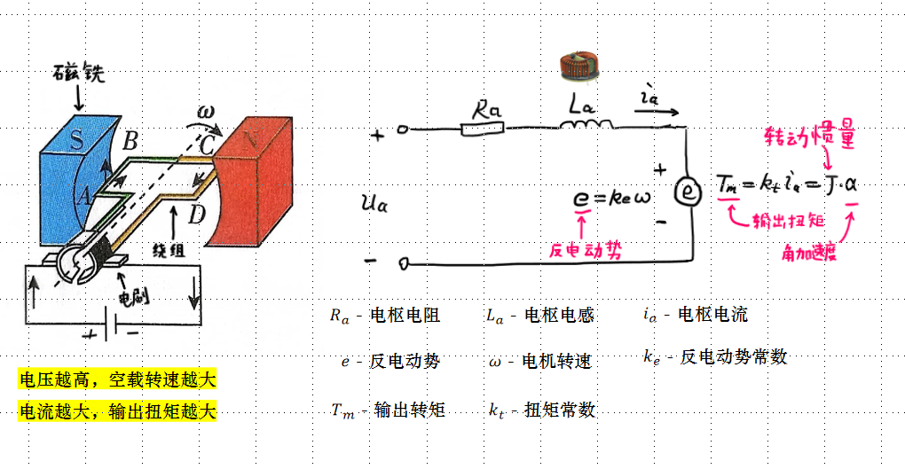
>

**电压决定最大转速，*e*=*BLv* sin*θ*（动生电动势）（其中 v 和角速度 w 属于⼀体）**

**电流决定输出扭矩，*F*=*BLI* sin*θ*（安培力）**

**推测运行的各个数值的变化：正常运行的时候，转速很快达到最大值，此时电流最小（不一定**

**为 0），此时可以输出的扭矩最小，**

**当外部出现负载的时候，负载↑-- 转速 w↓-- 反电动势 e↓-- 电流 i↑-- 输出扭矩↑，按照这个**

**流程慢慢的实现一个动态的平衡。**

**其中绕组存在电阻，同时存在电感，所以等效电路中要算上。**

> ****
>
>  ==**变化曲线**==
>
> 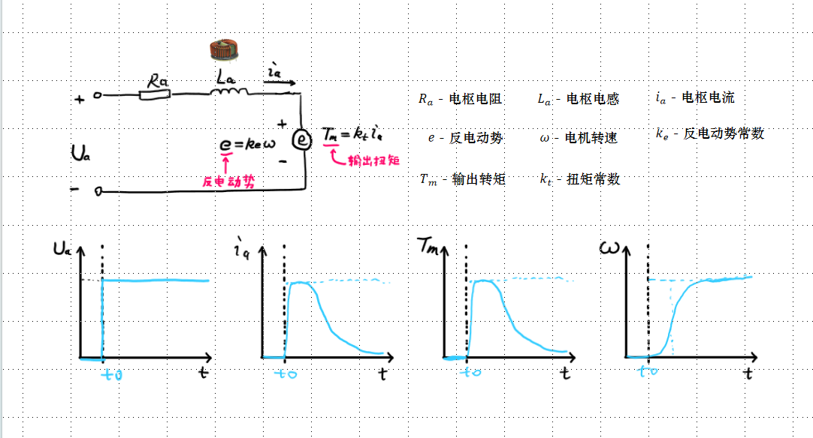

> ==**利用单片机定时器输出的pwm实现电压大小的控制**==
>
> 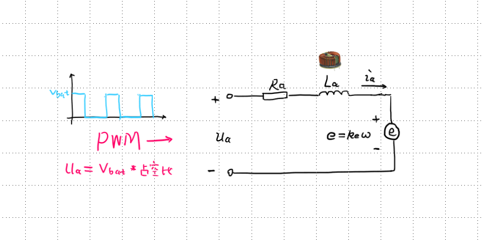

> **==利用H桥去实现电机的正反转==**
>
> **因单片机电压有限，不可以直接连接电机，所以将其作为开关，管理电池的电压来控制电机。**
>
> ****
>
> ==**原理：**==
>
> - **单片机给AIN1高电平、AIN2低电平 → TB6612内部左上和右下MOSFET开关闭合 → 电池正极电流从AO1流进电机，从AO2流回电池负极。电机正转。**
> - **反过来，单片机让AIN1低、AIN2高 → 右上和左下开关闭合 → 电池电流反向流过电机。电机反转。**
> - **如果想调速，单片机只需在PWMA脚上给一个高速开关的脉冲（PWM），驱动芯片就用这个脉冲去快速“接通/断开”电池，等效地管理了加在电机上的平均电压。**
>
> 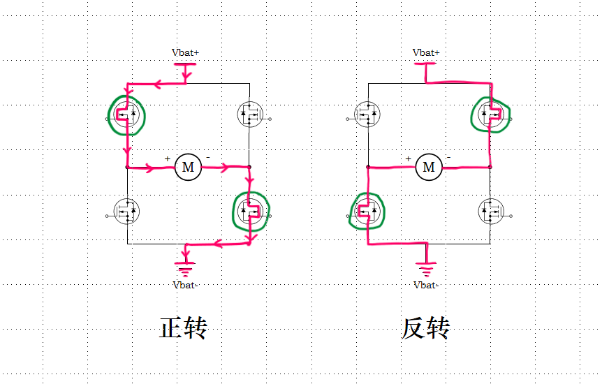
>
> 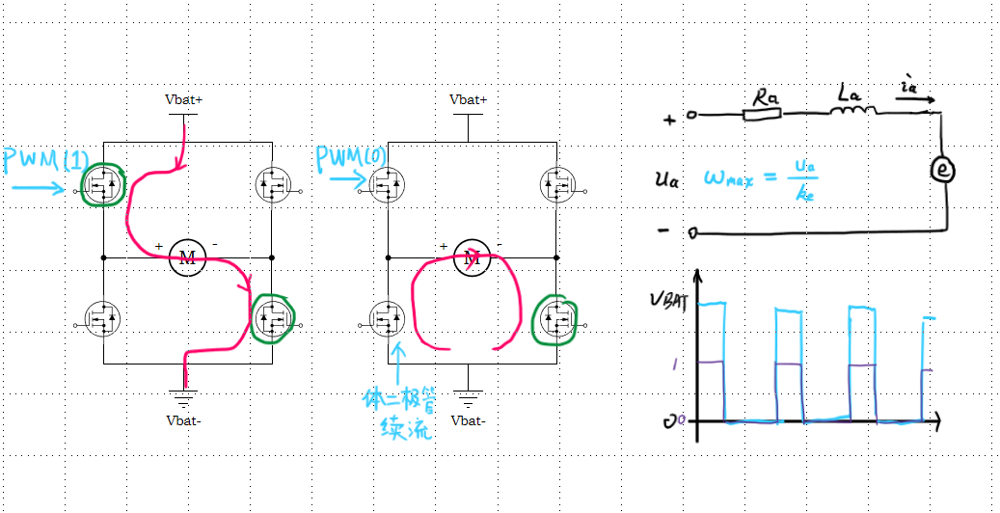
>
> **==tb6612连线图:==**
>
> 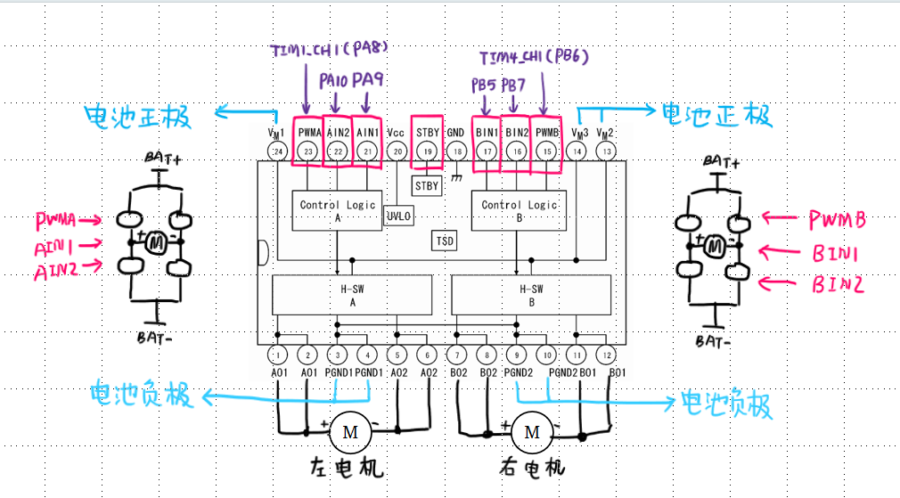

## 2.2【电机】电机调速原理(1)

### **前言:本节介绍button.c的整体架构及在项目中的好处**

### **1.整体架构**

```c
┌─────────────────────────────────────────────────┐
│                   应用层                         │
│  App_Button_Init() / OnUserKey_Clicked() 回调函数
│  App_Button_Proc()
├─────────────────────────────────────────────────┤
│                  按钮驱动层                       │
│  My_Button_Init()  →  初始化硬件+软件状态         │
│  My_Button_Proc()  →  消抖 + 状态机 + 回调触发   │
├─────────────────────────────────────────────────┤
│                  硬件抽象层                       │
│  GPIO_ReadInputDataBit()  读取引脚电平           │
│  GetTick()                获取系统时间            │
└─────────────────────────────────────────────────┘

```

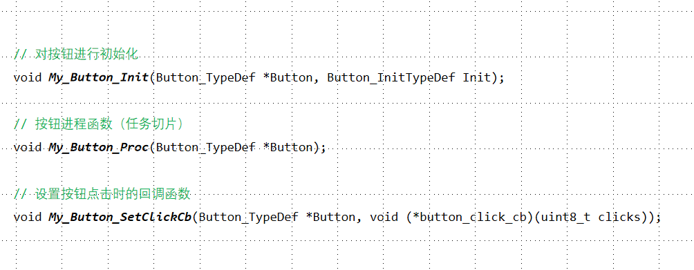

> ==**第一步：注册回调**==
>
> **在 `app_button.c` 里调用了：**
>
> ```
> My_Button_SetClickCb(&userKey, OnUserKey_Clicked);
> ```
>
> **这个函数内部就是一句简单的赋值：**
>
> ```c
> Button->button_clicked_cb = ClickCb;  // 将 OnUserKey_Clicked 的地址存起来
> ```
>
> **现在 `userKey.button_clicked_cb` 就指向了你的 `OnUserKey_Clicked` 函数。**
>
> **==第二步：进程函数不断轮询==**
>
> **在 `main` 函数的 `while` 循环里，你会调用：**
>
> ```c
> App_Button_Proc();   // 内部调用了 My_Button_Proc(&userKey);
> ```
>
> **`My_Button_Proc` 负责消抖、检测电平变化，然后调用内部的静态函数：**
>
> - **检测到按下 → `OnButtonPressed()`**
> - **检测到松开 → `OnButtonReleased()`**
> - **每次轮询都会调用 `OnButtonEveryPolled()`**
>
> ==**第三步：事件条件满足时，通过函数指针回调**==
>
> **以单击为例，在 `OnButtonEveryPolled` 函数里有这样的代码：**
>
> ```c
> if(Button->ClickCnt > 0 && Button->LastState == 0 
>    && (GetTick() - Button->LastReleasedTime) > Button->ClickInterval)
> {
>     if(Button->button_clicked_cb)   // 检查函数指针是否有效（不为0）
>     {
>         Button->button_clicked_cb(Button->ClickCnt);  // 通过指针调用你的函数
>     }
>     Button->ClickCnt = 0;
> }
> ```
>
> **当判断出“确实是一次单击（或多击）事件”时，它就通过之前保存的函数指针 `button_clicked_cb`，直接调用了你的 `OnUserKey_Clicked` 函数，并把连击次数传给你。**

####  **应用层**

```c
static Button_TypeDef userKey; // 用户按钮

static void OnUserKey_Clicked(uint8_t clicks);//回调函数

//
// @简介：按钮初始化
//
void App_Button_Init(void)
{
	Button_InitTypeDef Button_InitStruct = {0};
	
	Button_InitStruct.GPIOx = GPIOA;
	Button_InitStruct.GPIO_Pin = GPIO_Pin_11;
	
	My_Button_Init(&userKey, &Button_InitStruct);
	
	My_Button_SetClickCb(&userKey, OnUserKey_Clicked);// 完整点击（含连击）
}

void App_Button_Proc(void)
{
	My_Button_Proc(&userKey);
}

static void OnUserKey_Clicked(uint8_t clicks)//回调函数
{
	if(clicks == 2)
	{
		// 翻转电机状态
		if(pwm_on == 0)
		{
			pwm_on = 1;
		}
		else
		{
			pwm_on = 0;
		}
		
		App_PWM_Cmd(pwm_on);
	}
}

```

#### ==**回调函数机制详解**==

```c
调用链路：

button.c 内部                        app_button.c 内部
┌──────────────────┐                ┌──────────────────────────┐
│                  │                │                          │
│ OnButtonEvery    │  函数指针调用   │  OnUserKey_Clicked()     │
│ Polled() ───────────────────────→ │  {                       │
│                  │                │    if(clicks == 1)       │
│  button_clicked_ │                │      翻转电机状态         │
│  cb(clicks)      │                │  }                       │
│                  │                │                          │
└──────────────────┘                └──────────────────────────┘
       驱动层                              应用层

```

```c
// 驱动支持的四种事件回调
My_Button_SetPressCb(&btn, onPress);        // 按下瞬间
My_Button_SetReleaseCb(&btn, onRelease);    // 松开瞬间
My_Button_SetClickCb(&btn, onClick);        // 完整点击（含连击）
My_Button_SetLongPressCb(&btn, onLongPress);// 长按（含持续触发）

```

### **2.在项目中的好处**

#### ==1. 解耦：底层驱动与业务逻辑彻底分离==

```c
button.c 完全不知道：
  - 用户按下按钮后想做什么
  - 系统中有多少个按钮
  - 按钮连的是PA11还是PB3

app_button.c 完全不需要知道：
  - 消抖算法怎么实现的
  - 长按怎么检测的
  - GPIO怎么读取的

```

**好处：** 换个项目，`button.c` 原封不动直接复用，只需重新写 `app_button.c`。

------

#### 2. 复用：一套驱动，到处使用

`button.c` 和 `button.h` **是一个通用的模块**。今天用按钮控制电机，明天做一个温控器、智能灯，**还是用同一份 button.c**。

不同的项目，只需注册不同的回调函数：

- 控制电机 → 回调里写 `App_PWM_Cmd()`
- 控制灯泡 → 回调里写 `ToggleLight()`
- 进入设置菜单 → 回调里写 `EnterMenu()`

这样，**稳定的底层代码不动，多变的上层需求随意换**。

------

#### 3. 实时性：事件发生时立刻响应，不用在主循环里反复查状态

如果不使用回调，你可能要在 `main` 函数的 `while` 循环里这么写：

```
while(1) {
    if(My_Button_GetState(&userKey) == 1 && 上次状态==0) {
        // 手动判断是否是单击、长按...
    }
    // 做其他事...
}
```

这会让主循环塞满各种if判断，逻辑混乱，还容易漏事件。

而有了回调，**按钮事件一确认，你的处理函数就被立刻调用**，就像保安一看到主人回来就马上开门，而不是等你问“有人吗？”才开。

------

#### 4. 扩展性：支持多种事件，互不干扰

同一个按钮，可以同时注册**按下、松开、单击、连击、长按**等多个回调。每个回调处理不同的功能，清晰明了。比如：

- 按下：电机开始转，蜂鸣器短响一下
- 松开：电机停止
- 长按：进入速度设置模式

这些事件在 `OnButtonEveryPolled` 里被统一处理并分发，你只需要分别实现对应的回调即可，不会相互干扰。

```c
while(1) 循环
    │
    ├─→ My_Button_Proc(&userKey)
    │       │
    │       ├─ 读取GPIO电平
    │       ├─ 消抖处理
    │       ├─ 检测到按下  →  自动调用 PressCb()
    │       ├─ 检测到松开  →  自动调用 ReleaseCb()
    │       ├─ 连击窗口到期 →  自动调用 ClickCb(clicks)
    │       └─ 长按超时    →  自动调用 LongPressCb(ticks)
    │
    ├─→ My_Button_Proc(&btn2)    // 其他按钮...
    ├─→ 其他业务代码...
    └─→ ...

```

你只需要在 `App_Button_Init()` 里把需要的回调注册好，`while(1)` 里调用 `Proc`，剩下的驱动全部自动完成：

```c
// 初始化时注册好
void App_Button_Init(void)
{
    // ...初始化...
    My_Button_SetPressCb(&userKey, OnPress);
    My_Button_SetReleaseCb(&userKey, OnRelease);
    My_Button_SetClickCb(&userKey, OnUserKey_Clicked);
}

// 主循环里只管调用
int main(void)
{
    App_Button_Init();

    while(1)
    {
        App_Button_Proc();   // 这一行就够了
    }
}
```

------

#### 5. 可维护性和可读性

想象一下，如果你把消抖逻辑、状态判断、PWM控制全部揉在一个 `main.c` 里，代码会非常臃肿。而有了这种分层设计：

- 看 `app_button.c` 就知道“按钮按下后会发生什么”

- 看 `button.c` 就知道“按钮的底层检测逻辑”

- 出了问题，能快速定位：是硬件检测错了，还是上层逻辑写错了

	

## **2.2【电机】电机调速原理(2)**

### **前言:利用定时器输出PWM来控制电机的转速，涉及到PWM的==分辨率及周期==**

1.  **不能忽略电感 La 的作用（图1为理想化情况）。**
2.  **低频 PWM（图2）会让电机在低速时剧烈抖动。**
3.  ==**高频 PWM + 高分辨率（图3）是工程实践的黄金组合：高频利用电感平滑电流消除抖动，高分辨率提供精细的电压调节，使电机从静止到高速全程平滑运行。**==

> 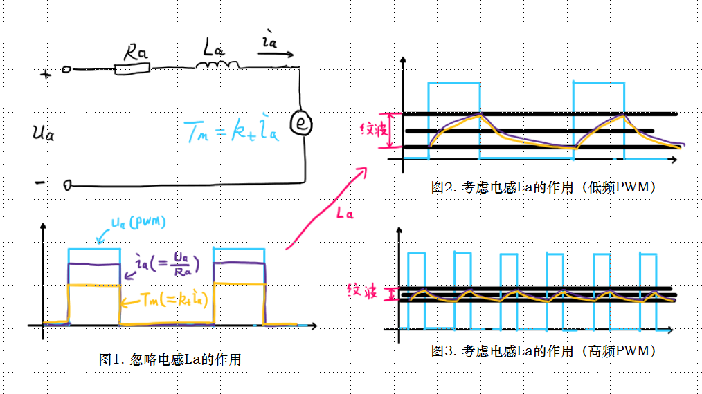

### 1. 核心原理（左上电路图）

**电机电路中含有电枢电阻（Ra）和电枢电感（La）**。

*   **电磁转矩公式：Tm = kt * ia（转矩与电枢电流 ia 成正比）。**
*   **电感特性：电感（La）==具有“通直流、阻交流”的特性==，它会对 PWM 高频开关电压起到“低通滤波”作用。**

---

### 2. PWM 频率的取值及原理（对比图2与图3）

*   **取值原则：频率越高越好（通常建议选 10 kHz ~ 20 kHz）。**
*   **原理：**
    *   **图2（低频 PWM）：开关频率低，每个脉冲宽度很长。在脉冲导通时，电流 ia 会上升到很高；在脉冲关断时，电流 ia 又会下降到很低。这导致电流 ia 和转矩 Tm 出现巨大的波动（大幅纹波）。**
        *   **后果：电机低速抖动、发热、产生可闻噪音。**
    *   **图3（高频 PWM）：开关频率高，每个脉冲宽度极短。因为电感的“阻交流”作用，电流 ia 在极短时间内来不及大幅上升或下降。这使得电流 ia 非常平滑，转矩 Tm 波动极小（微弱的纹波）。**
        *   **好处：电机运转平稳、静音、发热少。**
    *   ==**结论：只要频率足够高，电感 La 就能像滤网一样，把 PWM 的脉动电压平滑成接近完美的直流电流，从而实现平稳调速。**==

---

### **3. PWM 周期的取值及原理**

*   **取值原则：周期 = 1 / 频率。频率越高，周期越短。**
*   **原理：PWM 周期必须远小于电机绕组的电气时间常数（τ = La / Ra）。**
    *   **图2（长周期）：电流有充足的时间跟随 PWM 变化，导致电流断续或大幅波动。**
    *   **图3（短周期）：在电流还没来得及明显变化时，下一个开关动作就已经开始了，电感锁住了电流。**
    *   **结论：周期越短，电感对电流的“拉住”作用越明显，电流波形越接近平直的直线。**

---

### **4. PWM 分辨率的取值及原理**

*   **取值原则：位数越高越好（建议使用 8 位 / 256级，或 10 位 / 1024级，乃至 12/16 位）。**
*   **原理：==分辨率指你调节占空比（输出电压比例）的精细程度==。**
    *   **如果分辨率很低（例如只有 4 级调节），PWM 占空比只能从 25% 直接跳到 50% 再跳到 75%。这会导致电机转速突然跳变，产生顿挫感。**
    *   **在高分辨率（比如 1024 级）下，你可以将占空比逐渐增加，电机转速可以无极平滑地上升。**
    *   **重要应用场景：在电机低速运行时，分辨率尤为重要。如果低分辨率导致电压调节阶梯过大，电机在低速时会忽快忽慢，无法平稳运行。**

> 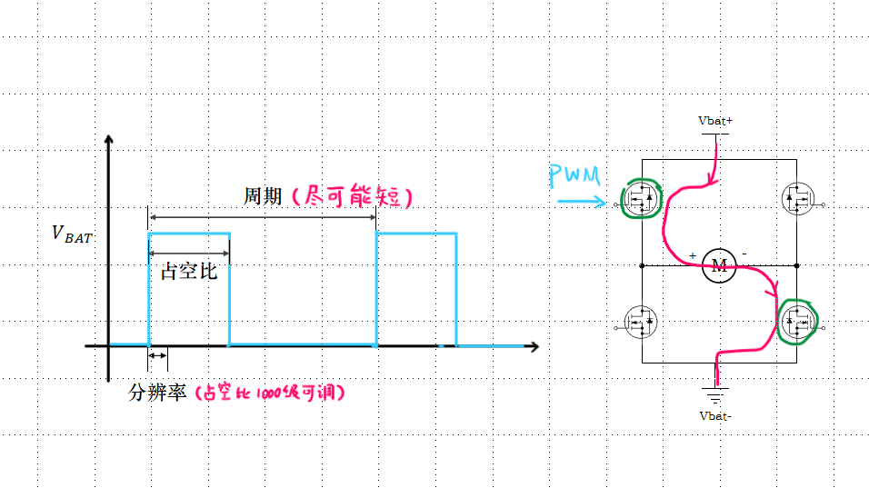

### **定时器的原理及设置参数**

```c
   // 设置时基单元的参数
	TIM_TimeBaseInitTypeDef TIM_TimeBaseInitStruct = {0};
	
	TIM_TimeBaseInitStruct.TIM_CounterMode = TIM_CounterMode_Up;
	TIM_TimeBaseInitStruct.TIM_Period = 999;//1000级可调
	TIM_TimeBaseInitStruct.TIM_Prescaler = 0;//周期=1/7200
	TIM_TimeBaseInitStruct.TIM_RepetitionCounter = 0;
	
	TIM_TimeBaseInit(TIM1, &TIM_TimeBaseInitStruct);
	
	// 配置输出比较
	TIM_OCInitTypeDef TIM_OCInitStruct = {0};
	
	TIM_OCInitStruct.TIM_OCMode = TIM_OCMode_PWM1;
	TIM_OCInitStruct.TIM_OCPolarity = TIM_OCPolarity_High;
	TIM_OCInitStruct.TIM_OutputState = ENABLE;
	TIM_OCInitStruct.TIM_Pulse = 0;
	
	TIM_OC1Init(TIM1, &TIM_OCInitStruct);
```

> 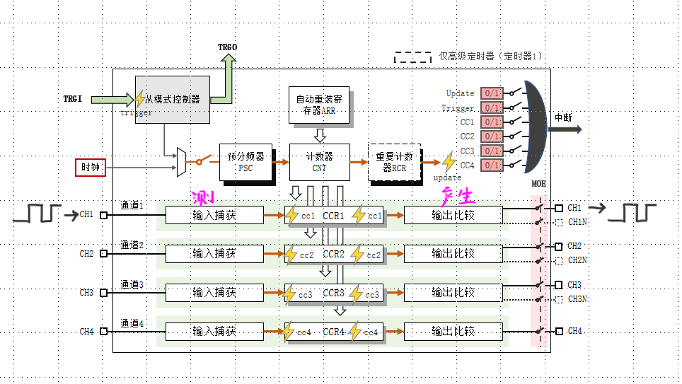
>
> 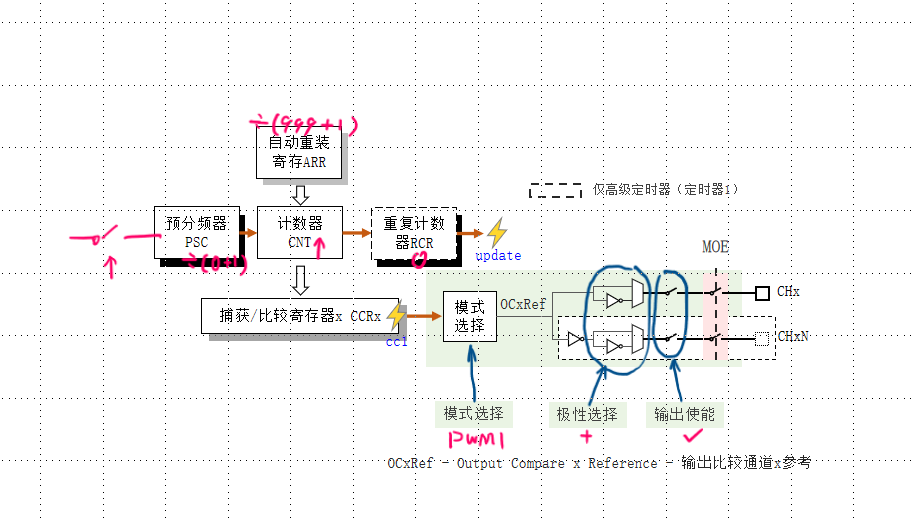
>
> **注意：配置输出⽐较的时候，相应的 GPIO ⼝也要要单独配置模式。**
>
> **同时还要注意最后闭合 MOE 开关。**
>
> 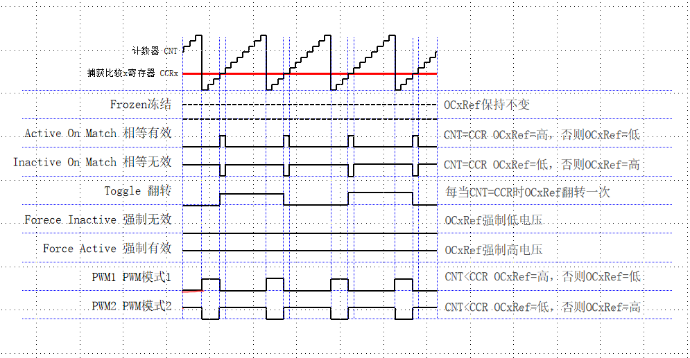

# 三、编码器测量

## 3.1【编码器】位置测量(1)

### 位置测量原理：

前面的电机控制中一般为开环，若在高精度场合可以利用**编码器**或**位置传感器**进行闭环控制。 **霍尔式编码器将电机的机械旋转，转换为电信号（脉冲），通过软件对脉冲的计数和相位的判断来反推当前位置。**

> 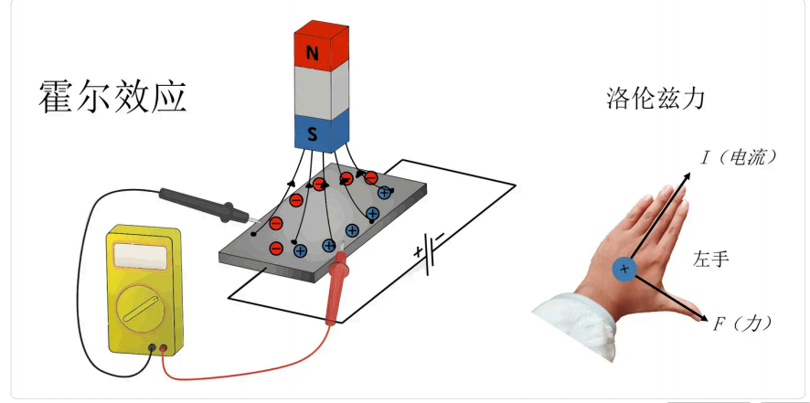

> 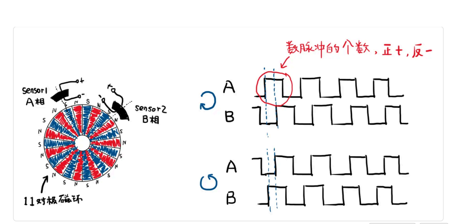

==**第一步：如何判断旋转方向（看哪根线先来）**==

- **图示关键点**：图中的 **A相** 和 **B相** 是两个在空间上错开一定角度（电气角度90度）的传感器信号。
- **正向旋转（图中上方波形）**：传感器1 (A) 先遇到磁极，传感器2 (B) 后遇到磁极。此时 **A波形领先于B波形** 90度。
- **反向旋转（图中下方波形）**：传感器2 (B) 先遇到磁极，传感器1 (A) 后遇到磁极。此时 **B波形领先于A波形** 90度。
- **工程判据**：程序一般会检测任意一路信号的**上升沿**时刻，去读取另一路信号的电平状态。如果A上升时B为低电平，则表示正转；如果A上升时B为高电平，则表示反转。（方向信号用于控制计数器的“加”或“减”）。

==**第二步：如何测量实际位置（数脉冲）**==

- **磁极对数为已知条件**：左侧磁环标注了 **“11对极”**。意味着磁环一周被分为了11个N-S磁极对。
- **电气周期**：每经过一对磁极（N+S），传感器会输出1个完整的方波周期。因此：
	- **机械角度 / 周期** = 360° / 11 ≈ **32.7°**。
- **计数精度提升（四倍频技术）**：
	- 虽然只有11个周期，但利用A相和B相的**相位差**，控制器可以同时捕捉到 **A相上升沿、A相下降沿、B相上升沿、B相下降沿**。
	- 这意味着，在一个完整的方波周期内，你可以数出 **4个脉冲边沿**。
	- **实际分辨率计算**：单圈总脉冲数 = 11（对极） × 4（边沿个数/对极） = **44 个脉冲/圈**。
	- **理论最小可测角度** = 360° / 44 = **8.18°**。

==**第三步：累计与清零**==

- 图中的红字“**数脉冲的个数，正+，反-**”是核心逻辑。
- 编写单片机程序时，会用一个**计数器（Counter）**：
	- 正转时，每检测到一个边缘脉冲，**计数器 +1**。
	- 反转时，每检测到一个边缘脉冲，**计数器 -1**。
	- **实时位置** = 计数器值 × 8.18°（或换算成毫米/弧度）。

> ==通过EXTI去捕获上升沿与下降沿==
>
> 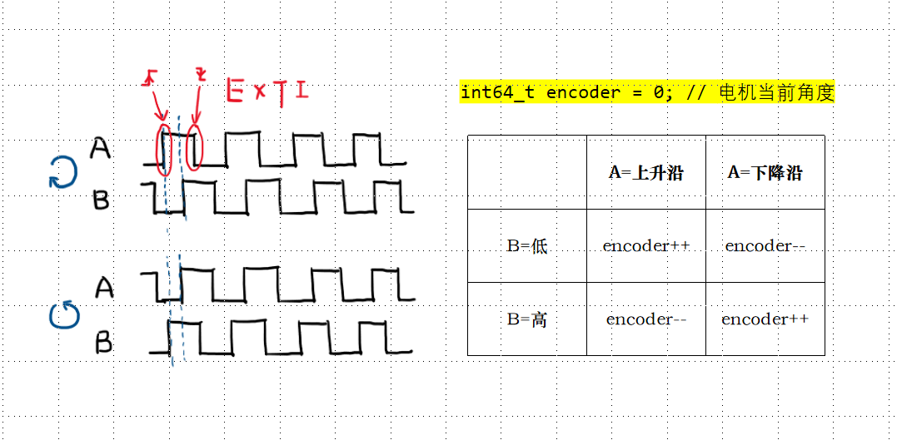

### **EXTI代码的配置及注意事项：**

**在 STM32 中，任何一个外设在工作之前，都必须先打开它的时钟，否则无法读写该外设的寄存器。**
**AFIO 主要负责：**

- **引脚复用功能的重映射**（例如把 USART1 的 TX/RX 从 PA9/PA10 改到 PB6/PB7）；
- **外部中断（EXTI）配置**（选择某个 GPIO 端口连接到 EXTI 线，需设置 `AFIO->EXTICR` 寄存器）；
- **JTAG/SWD 调试引脚的释放**（将 JTAG 部分引脚当作普通 GPIO 使用时，需通过 AFIO 重映射）；
- 一些特殊的外设重映射（如 TIM3、SPI1 等），以及 **事件输出** 等。

> **原理图**
>
> 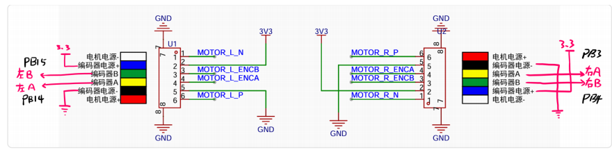
>
> 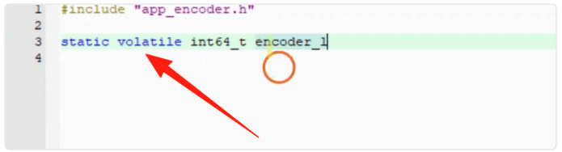

**注意：这里要用 int，因为从零开始逆时针旋转的时候，会变成负数。**

**因为变动很快，所以定义变量的时候要采用volatile，防止被编译器优化。**

> 
>
> 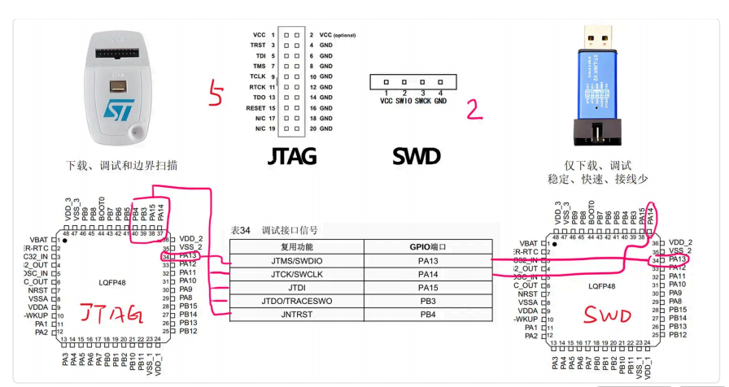

**右电机要使用 PB3、PB4 的 IO 口，但是这两个默认是用于调试接口的，**

**采用的策略就是重映射，将功能转移或者关闭 JTAG 的调试功能，即可将这两个接口释放，才**

**能进而配置为正常的 IO 口。**

> 
>
> 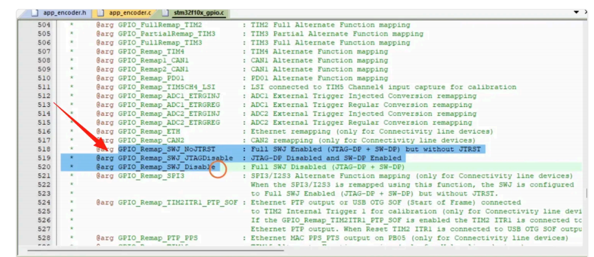

**根据规格书，调试端口主要是这四种状态，第⼀种是默认的，后续不同的状态可以释放不同的IO口。**

**后续三个可以在重映射配置中选择这三个模式填入。**

> ==**EXTI的中断框图**==
>
> 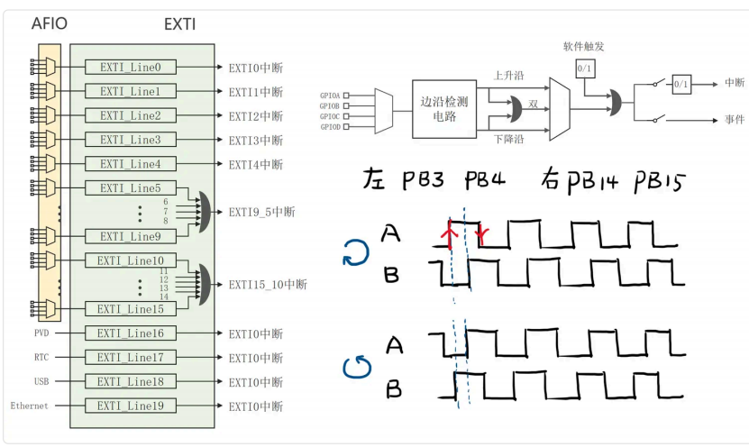

## 3.2【编码器】位置测量(2)

### **完成代码编写后，通过VOFA观察波形**

**电机正转,encoder++;反转,encoder- -**

**==注意==：**

1. **实际上由于平衡车两电机的位置相反，encoder在代码中的增减逻辑相反。**
2. **只对 A 相信号配置双边沿中断（上升沿和下降沿都触发）。这样在每个 A 相周期内，可以利用上升沿和下降沿计数两次**

> 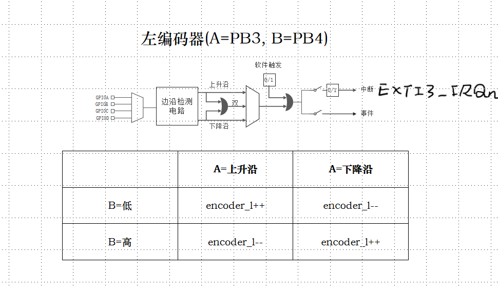
>
> 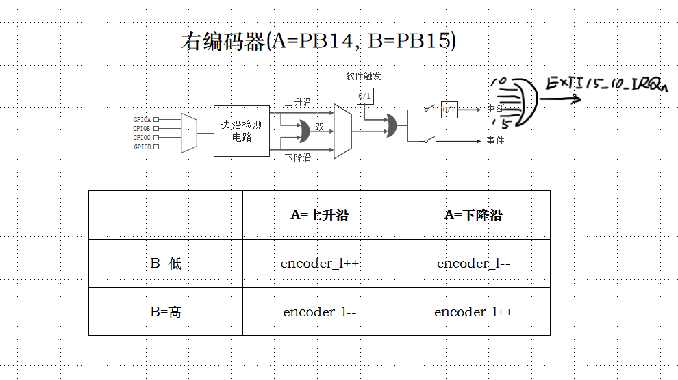
>
> 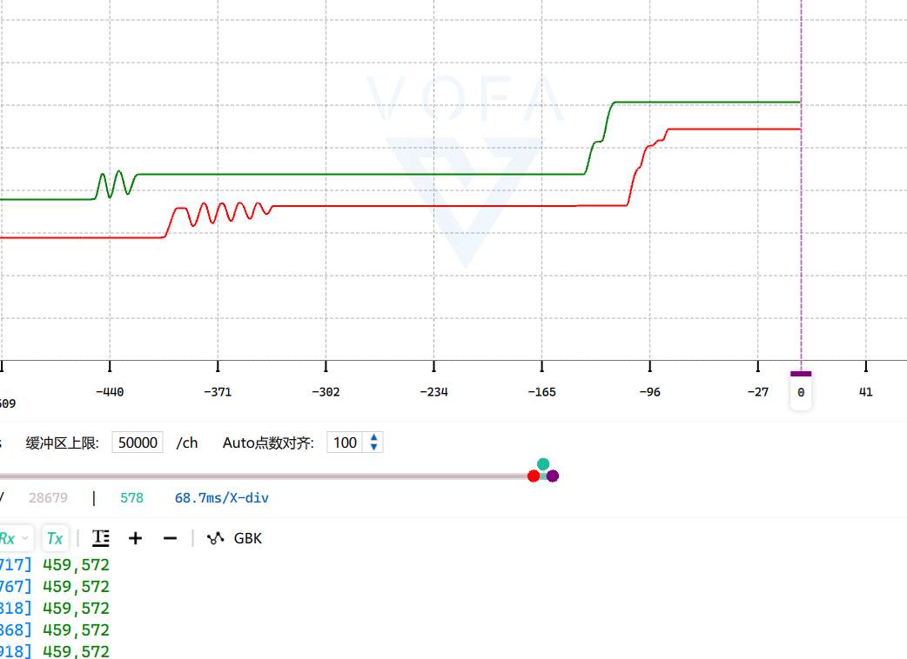


## 3.3【编码器】计算减速比

### **前言：减速比在你的编码器系统里的作用**

你现在的程序用中断记录了编码器的脉冲数 `encoder_l` 和 `encoder_r`，但这些值只是**电机轴端**（或编码器轴端）的原始脉冲计数。
要得到车轮的实际转角、转速或行走距离，必须考虑减速比和编码器本身的线数（分辨率）

> 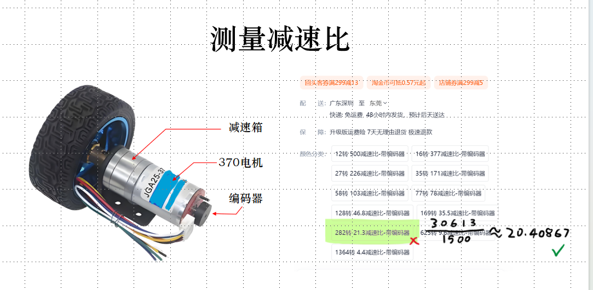
>
> 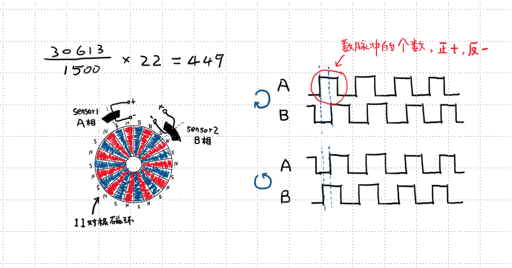

### **电机的实际角度与encoder关系**

```c
encoder_l / 22.0f / (30613.0f / 1500.0f) * 360.0f
```

1. **22代表的是二倍频，对A项采用双边沿计数，又因为是11对极，11*2=22.**

2. **(30613.0f / 1500.0f) 是减速比**

	

## 3.4【编码器】M法测速

### **前言：本节采用M法测速，分析M法对此平衡车项目是否合适**

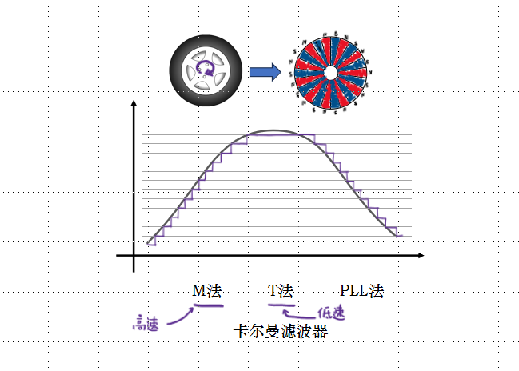

#### **1.M法（测频法）：适用于高速**

- **原理**：在固定的采样时间（比如 1ms）内，计算编码器发出的脉冲数（频率）。
- **优点**：
	- **适合高速**：电机转得越快，单位时间内的脉冲数越多，计算出的速度精度就越高。
	- **实现简单**：只需要简单的计数器电路或定时器中断。
- **缺点**：
	- **低速表现差**：电机转速很低时，采样时间内可能只有1个脉冲，甚至没有脉冲（**图中阶梯状现象最明显的地方**）。这会导致速度测量结果不连续，==量化误差极大==。例如测到1个脉冲是50rpm，下一段可能测到0个脉冲是0rpm。

#### 2. T法（测周法）：适用于低速

- **原理**：测量两个相邻脉冲之间的时间间隔（周期）。通常用一个远高于编码器频率的“高频时钟脉冲”来填充这个时间间隔。
- **优点**：
	- **适合低速**：转速越低，两个脉冲之间的时间间隔越长，高频时钟计数值越多，测量结果越精确。
	- **响应快**：实时性非常好，每经过一个编码器边缘就能更新一次速度。
- **缺点**：
	- **高速表现差**：转速很高时，两个脉冲之间的时间很短，高频时钟可能只能计1个甚至0个脉冲，导致测量结果严重失真。

#### 3. PLL法（锁相环法）：侧重于低速改善

- **本质**：它通常不是一种独立的测量算法，而是**硬件/底层技术**。在低速时，编码器的脉冲频率很低，T法测量容易受到干扰。PLL（锁相环）可以将低频脉冲信号**倍频**（比如将原本一圈100个脉冲倍增到1000个脉冲）。
- **作用**：极大地提高了低速时的脉冲分辨率，配合T法使用，能显著提升极低速下的测量精度和平滑度。

#### 4. 卡尔曼滤波器（Kalman Filter）：通用优化算法

- **本质**：它不是“测量”方法，而是一种**软件数据融合与平滑算法**。图中将其与“低速”联系在一起，说明在低速梯状跳变严重时效果最显著。
- **原理**：利用电机的物理模型（如：位置=速度的积分，速度=加速度的积分），结合上面各种方法测出的“含有噪声和量化误差的离散速度值”，进行最优估算。
- **优点**：可以强行消除掉图中的“阶梯状”锯齿，输出平滑、连续、实时性高的速度曲线。它甚至可以预测出传感器未采样的中间时刻的速度。

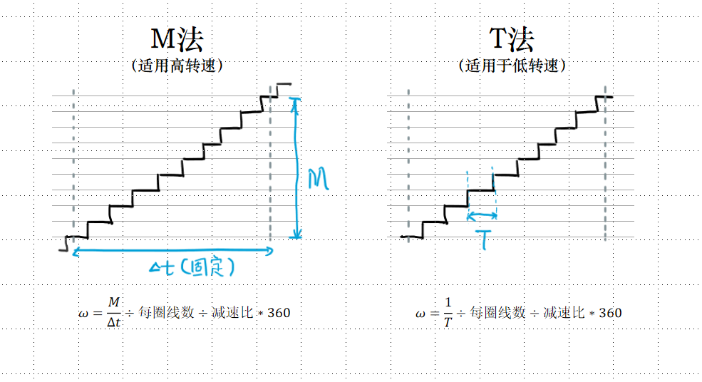

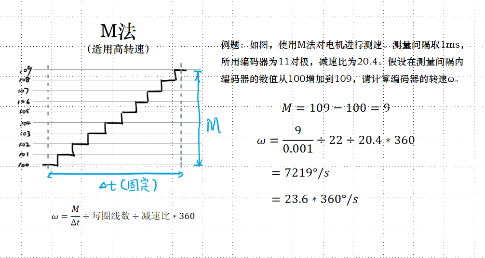

**有此例看出，只有当转速达到每秒23圈，测速才精确。**

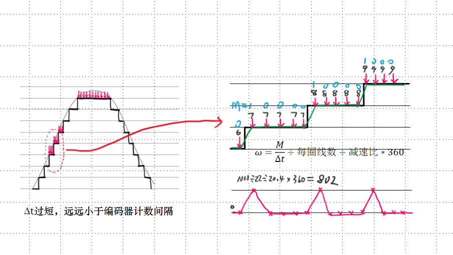

**电机转速很低时，采样时间内可能只有1个脉冲，甚至没有脉冲，导致测得的速度要么很大，要么为0**

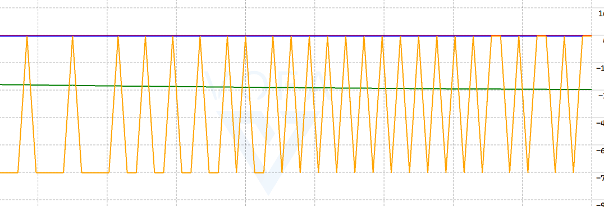

## 3.5【编码器】T法测速

###  T法（测周法）：适用于低速

- **原理**：测量**两个相邻脉冲之间的时间间隔**（周期）。通常用一个远高于编码器频率的“高频时钟脉冲”来填充这个时间间隔。
- **优点**：
	- **适合低速**：**转速越低**，两个脉冲之间的时间间隔越长，高频时钟计数值越多，**测量结果越精确。**
	- **响应快**：实时性非常好，每经过一个编码器边缘就能更新一次速度。
- **缺点**：
	- **高速表现差**：转速很高时，两个脉冲之间的时间很短，高频时钟可能只能计1个甚至0个脉冲，导致测量结果严重失真。


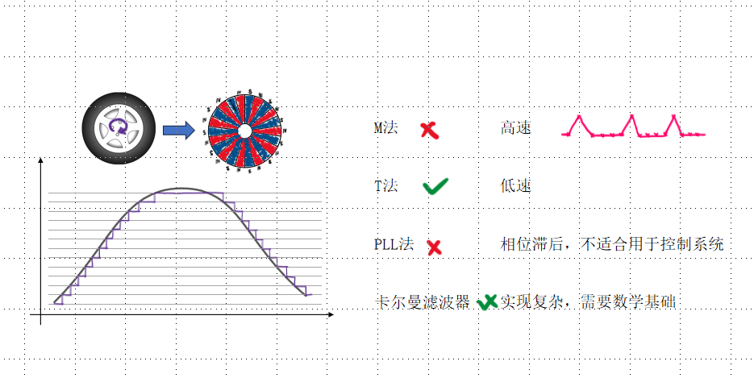

### **单片机中编写**

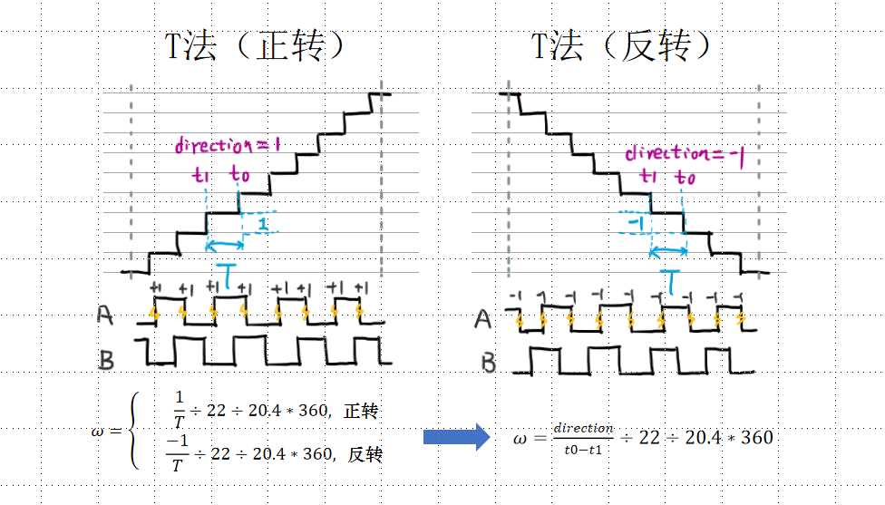

**波形**

**由图可见：曲线仍有问题，还需改进代码。**

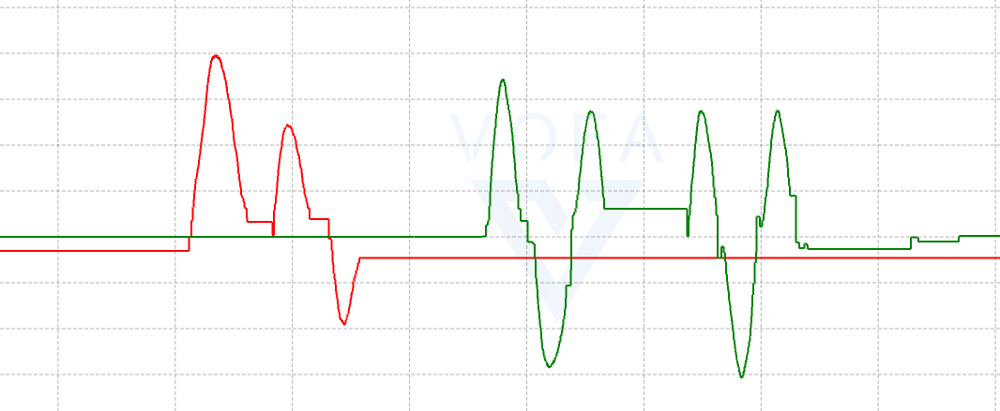

## 3.6【编码器】T法测速改进

### **出现的问题：**

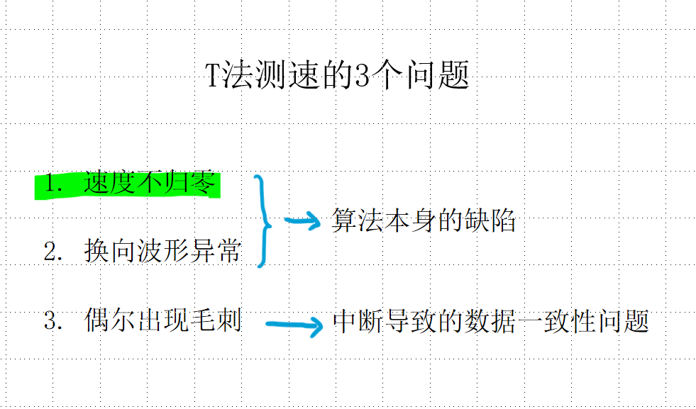

### **1.速度不归零**

**因为速度总是滞后一个周期，当运动停止时，由于数据记录的是上一个周期的速度，导致速度无法归零。**

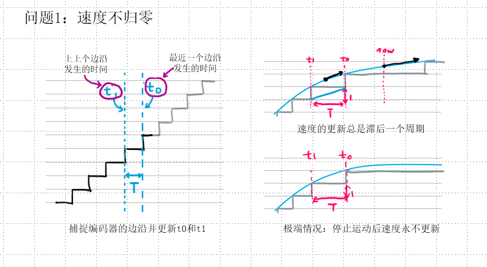

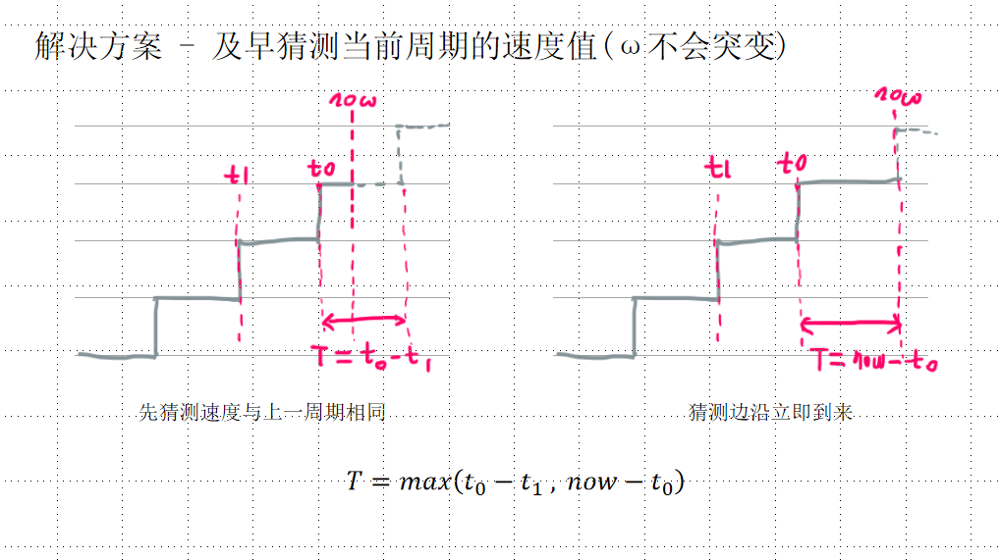

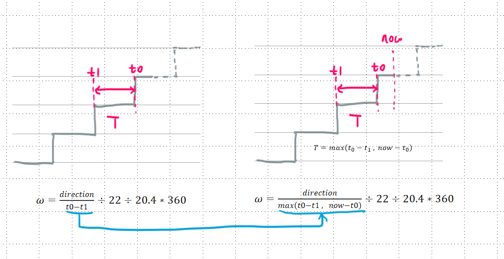

### 2.换向波形异常

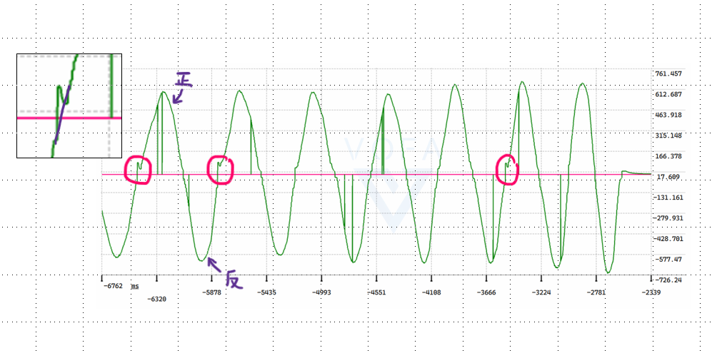

**在换向的过程中，可能会出现极小的窄脉冲，导致速度变化很大**


**解决方案**


###  3.偶尔出现毛刺

**由于中断会打断常规程序，在计算速度的常规程序中，由于中断对数据的更新，导致计算出现异常。**


**因为出现了负数，uint_64无法显示，导致溢出，得到的值非常大，此时算出的速度为0，**


**解决方案：在计算程序中先关闭中断，提前保存数据，在打开中断。**


# 四、MPU6050

## 4.1【MPU6050】介绍

### **前言**：

 **MPU6050** 是由 InvenSense（现属 TDK）推出的一款经典的 **6 轴运动处理传感器**，内部集成了 **3 轴陀螺仪** 和 **3 轴加速度计**，并带有一个板载的 **数字运动处理器（DMP, Digital Motion Processor）**。它能通过 **I²C 接口** 输出角度速度、加速度原始数据，或者通过 DMP 直接输出姿态四元数，大量用于平衡车、四轴飞行器、机器人、体感设备等场景。

**本次项目采用手动计算数据，使用互补滤波的算法**

==为什么需要互补滤波？==

- **陀螺仪**：输出角速度，积分得到角度。短期非常准，但由于零偏、噪声，积分结果会随时间无限漂移。
- **加速度计**：可以通过重力方向算出倾斜角（俯仰 / 横滚）。但运动加速度（震动、平移）会严重污染结果，不能直接用作姿态。
- **融合思路**：把陀螺仪积分的高频部分保留，加速度计的低频（长期）部分用来修正漂移。
	传递函数上就是：**高通滤波(陀螺仪) + 低通滤波(加速度计) = 全通**。


**MPU6050手册寄存器地址**


## 4.2【MPU6050】传感器原理

### 1、MEMS 加速度计原理

#### 1. 物理结构——微机械质量块 + 差分电容

加速度计的基本敏感单元是一个用硅微加工制造的可动质量块，通过弹性梁悬挂在固定框架上。质量块和固定电极之间形成**差分电容**，类似三明治结构：

- 中间为可动质量块（电极）
- 上下各有一块固定极板

当受到加速度时，质量块因惯性力发生位移，导致上下两个电容 C1*C*1、C2*C*2 一个增大一个减小。通过检测电容差变化，就能计算出位移量，再根据牛顿第二定律 F=m⋅a*F*=*m*⋅*a* 和弹性梁刚度推算出加速度。

#### 2. 工作原理

- **静止或匀速运动时**：质量块处于平衡位置，C1=C2*C*1=*C*2。
- **有加速度时**：惯性力 F=ma*F*=*ma* 推动质量块偏移，电容差 C1−C2*C*1−*C*2 与加速度成线性关系。
- **重力场下**：质量块同样受到重力作用，因此加速度计可以测量重力矢量，用于计算倾斜角（俯仰/横滚）。

#### 3. 关键公式

加速度计测量的不是纯加速度，而是**比力**：
**比力 = 物体绝对加速度 – 重力加速度**

所以当传感器静止时，测到的是重力反方向、大小为 1g1*g* 的矢量，凭此就能算出姿态倾角。

#### 4. 特性

- 静态性能好，长期稳定，无漂移
- ==**对振动和运动加速度敏感，瞬时噪声较大**==
- 量程可编程（±2g / ±4g / ±8g / ±16g），对应不同灵敏度（如 ±2g 时 16384 LSB/g）


**平衡车静止且直立的轴向加速度**

**注意：az不为0**


**平衡车静止但倾斜的轴向加速度**


### 2、MEMS 陀螺仪原理

#### 1. 物理结构——振动质量块 + 科里奥利效应

MPU6050 使用**音叉式振动陀螺**或类似结构：让一个质量块在平面内做固定频率的驱动振动（比如沿 X 轴左右振荡）。当传感器绕垂直轴（Z 轴）旋转时，振动质量块会受到 **科里奥利力** 作用，在正交方向（Y 轴）上产生位移。

#### 2. 科里奥利力

陀螺仪内部质量块受到的科里奥利力公式为：

​                                                                               **F_c = -2m (ω × v)**

- **F_c**：科里奥利力矢量（单位：牛顿）
- **m**：质量块的质量（单位：千克）
- **ω**：传感器旋转角速度矢量（单位：弧度/秒）
- **v**：质量块在驱动方向上的振动线速度矢量（单位：米/秒）
- **×**：矢量叉乘（结果方向由右手定则决定）

#### 3. 特性

- **动态响应极快，能准确反应瞬时角运动**
- ==**零偏和温漂会导致积分后的角度随时间无限漂移**==
- 量程可编程（±250 / ±500 / ±1000 / ±2000 °/s），对应灵敏度（如 ±250°/s 时 131 LSB/°/s）


## 4.3【MPU6050】寄存器读写

### **1.在单片机上初始化I2C引脚**


### 2.使用I2C接口读取寄存器


```c
//
// @简介：向寄存器写值
// @参数 reg - 要写入的寄存器的地址
// @参数 value - 要写入的值
//
static void reg_write(uint8_t reg, uint8_t value)
{
	uint8_t bytesToSend[] = {reg, value};
	
	My_I2C_SendBytes(I2C1, 0xd0, bytesToSend, 2);
}

//
// @简介：读取寄存器的值
// @参数 reg - 要读取的寄存器的地址
// @返回值：表示读取到的值
//
static uint8_t reg_read(uint8_t reg)
{
	My_I2C_SendBytes(I2C1, 0xd0, &reg, 1); // 发送寄存器的地址
	
	uint8_t regValue;
	
	My_I2C_ReceiveBytes(I2C1, 0xd0, &regValue, 1); // 读取一个字节
	
	return regValue;
}

```

### **3.MPU6050初始化**


**复位，关闭睡眠模式**


**设置陀螺仪量程：+-2000度/s**


**设置加速度量程：+-2g**


### **4.读取原始数据**


**将高字节的数据与低字节的数据拼在一起**


**根据量程进行换算**


```c
//
// @简介：更新mpu6050的值
//
void App_MPU6050_Update(void)
{
	int16_t ax_raw = (int16_t)((reg_read(0x3b) << 8) + reg_read(0x3c)); // ax的原始数据
	int16_t ay_raw = (int16_t)((reg_read(0x3d) << 8) + reg_read(0x3e)); // ay的原始数据
	int16_t az_raw = (int16_t)((reg_read(0x3f) << 8) + reg_read(0x40)); // az的原始数据
	
	ax = ax_raw * 6.1035e-5f;
	ay = ay_raw * 6.1035e-5f;
	az = az_raw * 6.1035e-5f;
	
	int16_t temperature_raw = (int16_t)((reg_read(0x41) << 8) + reg_read(0x42)); // az的原始数据
	
	 // temperature = temperature_raw / 340 + 36.53; // MPU6050
	temperature = temperature_raw / 333.87f + 21.0f; // MPU6500
	
	int16_t gx_raw = (int16_t)((reg_read(0x43) << 8) + reg_read(0x44)); // gx的原始数据
	int16_t gy_raw = (int16_t)((reg_read(0x45) << 8) + reg_read(0x46)); // gy的原始数据
	int16_t gz_raw = (int16_t)((reg_read(0x47) << 8) + reg_read(0x48)); // gz的原始数据
	
	gx = gx_raw * 6.1035e-2f;
	gy = gy_raw * 6.1035e-2f;
	gz = gz_raw * 6.1035e-2f;
}

```

**平衡车用的是MPU6500,温度计的计算要改变一下**


### 5.编写测试程序


## 4.4【MPU6050】解算欧拉角(上)

**欧拉角：**


**解算的流程：**


### **1.使用陀螺仪欧拉角：**


### **2.适配裸机多任务模型**

**在while中的任务切片不允许使用delay**


**因为传感器每5ms更新一次，所以要delay(5)**


**改进程序，适配逻辑多任务模型**


```c#
#include "delay.h"

#define PERIODIC(T) \
static uint32_t nxt = 0; \
if(GetTick() < nxt) return; \
nxt += (T);

#define PERIODIC_START(NAME, T) \
static uint32_t NAME##_nxt = 0; \
if(GetTick() >= NAME##_nxt) {\
NAME##_nxt += (T);

#define PERIODIC_END }
```

**这段代码定义了几个用于实现非阻塞周期性任务的宏，常用于嵌入式系统的 `while(1)` 主循环中。下面逐一解释。**

---

#### 1. `PERIODIC(T)`

```c
#define PERIODIC(T) \
static uint32_t nxt = 0; \
if(GetTick() < nxt) return; \
nxt += (T);
```

**功能**：快速生成一个周期为 `T` 个 tick 的“门控”，如果时间未到就直接 `return`，否则更新时间并继续执行后续代码。

**用法示例**：
```c
void main_loop() {
    while(1) {
        PERIODIC(1000);  // 每1000 tick执行一次
        // 这里的代码每1秒运行一次
    }
}
```

**严重局限性**：
- 静态变量 `nxt` **没有名字区分**，如果在同一个函数内多次使用 `PERIODIC(T)`，所有实例会共用一个 `nxt`，导致互相干扰。
- 只能用于**整个函数体仅包含一个周期性任务**的场景，不灵活。

---

####  2.`PERIODIC_START(NAME, T)` 和 `PERIODIC_END`

```c
#define PERIODIC_START(NAME, T) \
static uint32_t NAME##_nxt = 0; \
if(GetTick() >= NAME##_nxt) {\
    NAME##_nxt += (T);

#define PERIODIC_END }
```

**功能**：通过命名（`NAME`）生成独立的静态变量，允许在同一函数内**创建多个不同周期、互不干扰的定时任务**。

**用法示例**：
```c
void main_loop() {
    while(1) {
        PERIODIC_START(led, 500);
            LED_Toggle();
        PERIODIC_END

        PERIODIC_START(sensor, 100);
            ReadSensor();
        PERIODIC_END
    }
}
```

这里 `led` 和 `sensor` 分别拥有自己的 `led_nxt` 和 `sensor_nxt`，互不影响。

---

#### 两者对比

| 特性       | `PERIODIC(T)`                | `PERIODIC_START/END`         |
| ---------- | ---------------------------- | ---------------------------- |
| 变量命名   | 固定 `nxt`，易冲突           | 通过参数 `NAME` 生成独立变量 |
| 多任务支持 | 不支持（会互相干扰）         | 支持                         |
| 退出方式   | `return`（直接退出外围函数） | 代码块，自然结束             |
| 使用灵活性 | 简单但危险                   | 稍显冗长但安全               |

---

#### 注意事项与潜在陷阱

1. **`GetTick()` 的类型与溢出**  
   `GetTick()` 返回 `uint32_t`，而 `nxt` 也是 `uint32_t`。当 tick 累加溢出时，比较 `GetTick() < nxt` **在无符号数下依然正确**（利用了模运算），只要 `T` 不超出范围，定时不会出错。但必须保证 `GetTick()` 确实是单调递增的，并且不会被其他代码重置。

2. **`PERIODIC_END` 只是一个孤零零的 `}`**  
   这意味着它必须在句法上闭合前面的 `if {`，使用时不要漏掉。

3. **不能放在局部代码块内**  
   静态变量的初始化只在第一次执行时发生，如果宏被放在 `if`、`for` 等内部，可能导致不可预期的行为，但通常我们都是在主循环的直接作用域下使用，所以问题不大。

4. **初始行为**  
   `nxt` 初始值为 0，第一次调用时 `GetTick()` 几乎必定 ≥ 0，所以会立刻执行一次。这是常见的“第一次立即执行”逻辑。

5. **`PERIODIC(T)` 会导致函数返回**  
   如果函数在 `PERIODIC(T)` 之后还有其他逻辑，时间未到时后续逻辑完全不会执行。`PERIODIC_START/END` 则只会跳过对应的代码块，更符合结构化编程的习惯。

## 4.4【MPU6050】解算欧拉角(下)

### 1.用加速度计计算欧拉角


**偏航角测不出**


==**注意：加速度计测量的结果与重力方向相反**==


#### 1.测量pitch(俯仰角)


**注意：由于用反正切函数只能算出一四象限的角度，所以使用另一个函数**


#### 2.测量roll(翻滚角)


**因为取得是弧度，进行换算**

### 2.互补滤波

**==陀螺仪会产生飘移，加速度计会产生噪声==**


#### **==互补算法==**

**两个滤波器如何配合“除噪”？**

**互补算法的核心：**

- **高通滤波器（高通 = 放过高频，阻挡低频）**
	它作用于**陀螺仪**：直接把“低频漂移”（变化的慢的部分）给**切断**了。它只允许快速变化的角速度数据通过（用来判断瞬间转动）。
- **低通滤波器（低通 = 放过低频，阻挡高频）**
	它作用于**加速度计**：直接把“高频抖动”（变化的快的部分）给**磨平**了。它只允许缓慢变化的稳态角度通过（用来防止角度漂移）。


#### 1. 为什么要用“互补”？（看图的两个图表）

在测量物体的倾斜角度时，我们通常用到两种传感器：

- **陀螺仪（左侧图）：** 测量角速度，积分得到角度。
	- ✅ **优点：** 动态响应快，能迅速反应瞬间的旋转动作。
	- ❌ **缺点：** 存在**低频漂移**。随着时间的推移，积分误差会累积，导致角度慢慢飘走。
- **加速度计（右侧图）：** 测量重力加速度，算出当前静态倾角。
	- ✅ **优点：** 测量绝对角度，**没有长时间漂移**，长期准确。
	- ❌ **缺点：** 容易被振动和外部加速度干扰（**高频噪声**）。

**互补算法的核心思想就是：** 将陀螺仪（通过**高通滤波器**滤掉低频漂移）与加速度计（通过**低通滤波器**滤掉高频噪声）结合，让它们各自工作在擅长的频段上，从而得到一个**既稳定又灵敏**的最终角度。

------

#### 2. 图片底部的公式 α*α* 是什么意思？


因为你算出来的 α≈0.952，非常接近 1。

- 这意味着 **95.2%** 的权重给到了**陀螺仪**的积分值（利用它的**瞬间响应能力**）。
- 只有 **4.8%** 的权重给到了**加速度计**（利用它**拉回漂移、保持长稳的能力**）。

- 两者互补，就得到了一条干净、平滑、准确的姿态曲线。

## 4.5【快速三角函数】


**经测试，进行+-*/的时间如图：**

**由此可见，三角函数的计算对与单片机来说是非常耗时的**


**改进方法：查表法**


# 五、PID

## 5.1【PID简介】


### 一、PID 是什么

**PID（比例-积分-微分）是最经典的闭环控制算法，根据目标值 (Setpoint) 与实际值 (Input) 的偏差来调整输出 (Output)，使系统快速、稳定地达到目标。**


---

### 二、各部分作用

#### P — 比例 (Proportional)

**公式**：`Output = Kp × error`

| 性质         | 说明                                      |
| ------------ | ----------------------------------------- |
| **作用**     | 对当前偏差作出即时反应，偏差越大输出越大  |
| **Kp 增大**  | 响应变快，稳态误差减小，但过大会振荡/不稳 |
| **Kp 减小**  | 系统变"软"，响应慢，稳态误差大            |
| **单独使用** | 永远有稳态误差，无法完全消除              |

> ✈️ 类比：开车偏离车道，方向盘打得越大回正越快，但不能只靠比例。

#### I — 积分 (Integral)

**公式**：`Output = Ki × ∫e(t) dt`

| 性质         | 说明                               |
| ------------ | ---------------------------------- |
| **作用**     | 累计过去的偏差，消除稳态误差       |
| **Ki 增大**  | 消除静差快，但过大会导致超调和振荡 |
| **Ki 减小**  | 静差消除慢                         |
| **积分饱和** | 长时间大偏差导致积分项过大，需限幅 |

> ✈️ 类比：偏离车道很久了还没回正，方向盘逐渐加大力度，直到回到中心。

#### D — 微分 (Derivative)

**公式**：`Output = Kd × de/dt`

| 性质           | 说明                                 |
| -------------- | ------------------------------------ |
| **作用**       | 预测偏差变化趋势，提前抑制，减小超调 |
| **Kd 增大**    | 阻尼增大，抑制振荡，但过大会放大噪声 |
| **Kd 减小**    | 响应快但容易震荡                     |
| **D 不单独用** | 只对变化率响应，稳态时不输出         |

> ✈️ 类比：快要回到车道中心时，提前回正方向盘防止冲过头。

---

### 三、各环节对比总结

| 环节  | 响应对象         | 主要效果 | 过大后果      | 过小后果      |
| ----- | ---------------- | -------- | ------------- | ------------- |
| **P** | 当前偏差         | 快速响应 | 振荡/不稳定   | 响应慢/静差大 |
| **I** | 过去累计偏差     | 消除静差 | 超调/积分饱和 | 静差消除慢    |
| **D** | 偏差变化率(预测) | 抑制超调 | 放大噪声/抖动 | 容易振荡      |

---

### **四、如何调节**

**通过对被控对象进行建模,画波特图，计算参数**


## 5.2【控制系统的结构和关键指标】

### **1.控制系统的结构**


### **2.关键指标**

**定性分析**


**稳态误差**


**时域关键指标**

**阶跃响应曲线**


| 指标         | 符号     | 定义                                | 好        |
| ------------ | -------- | ----------------------------------- | --------- |
| **上升时间** | tr       | 从 10% 上升到 90% 稳态值的时间      | 小        |
| **峰值时间** | tp       | 到达第一个峰值的时间                | —         |
| **超调量**   | Mp (%)   | (峰值 - 稳态) / 稳态 × 100%         | 小 (<20%) |
| **调节时间** | ts (±2%) | 进入稳态值 ±2% 范围内不再超出的时间 | 小        |
| **稳态误差** | ess      | 稳态时目标值与实际值的偏差          | 0         |


## **5.3【PID】建模 - 电机的电学方程**


**简化**


**描述电机从两部分：电能与机械能**


**电机转动原理**


**建立模型**


###  电压平衡方程（KVL）

$$
V_a(t) = R \cdot i_a(t) + L \cdot \frac{di_a(t)}{dt} + e_b(t)
$$

$$
e_b(t) = K_e \cdot \omega(t)
$$

代入得：

$$
\boxed{V_a(t) = R \cdot i_a(t) + L \cdot \frac{di_a(t)}{dt} + K_e \cdot \omega(t)}
$$
**三个层次递进：**

| **层次** | **内容**                                 |
| -------- | ---------------------------------------- |
| **基础** | **等效电路、KVL 电压方程、转矩方程**     |
| **进阶** | **传递函数推导、状态空间模型**           |
| **实战** | **电机参数测量方法、PWM 等效、τe vs τm** |


## **5.4【PID】建模 - 电机的机械方程**

**有电能带动电机转动产生机械能**

**转速又受安培力大小，转子惯性，摩擦力的影响**


**转矩是力产生的转动效果**

**转动惯量是旋转世界的"质量"**


### 直流电机中的四种转矩

#### 1. 电磁转矩（电机产生的）

$$
\boxed{\tau_m = K_t \cdot i_a}
$$

这是电流通过磁场产生的驱动力矩，**电机的核心输出**。

| 符号 | 含义                              |
| ---- | --------------------------------- |
| Kt   | 转矩常数 (N·m/A)，且 Kt = Ke (SI) |
| ia   | 电枢电流 (A)                      |

#### 2. 负载转矩（外部施加的）

平衡车上的负载转矩来源：

- 重力产生的倾倒力矩
- 地面摩擦力
- 加速上坡的附加阻力
- 风阻

#### 3. 摩擦转矩

$$
\tau_f = B \cdot \omega
$$

| B | 粘滞摩擦系数 | 与转速成正比 |

#### 4. 惯性转矩

$$
\tau_J = J \cdot \frac{d\omega}{dt} = J \cdot \alpha
$$

加速时需要克服的"转动惯性"。


### **计算实际的转动惯量(加轮胎)**


**对轮胎分解**


### **电机的机械方程**


#### 1. 转矩方程

$$
T_m(t) = K_t \cdot i_a(t)
$$

| 符号 | 含义     | 单位  |
| ---- | -------- | ----- |
| Tm   | 电磁转矩 | N·m   |
| Kt   | 转矩常数 | N·m/A |

> **重要：对于国际单位制 (SI)，Ke = Kt（数值相等）**
>
> **电机本质是电能 ↔ 机械能的转换器**

#### 2. 机械运动方程

$$
J \cdot \frac{d\omega(t)}{dt} + B \cdot \omega(t) = T_m(t) - T_L(t)
$$

| 符号 | 含义                | 单位        |
| ---- | ------------------- | ----------- |
| J    | 转子 + 负载转动惯量 | kg·m²       |
| B    | 粘滞摩擦系数        | N·m/(rad/s) |
| TL   | 负载转矩            | N·m         |

### **电机的电学方程与机械方程**


## 5.5【PID】建模 - 电机的传递函数(拉普拉斯变换)

### 核心操作

**拉普拉斯变换做的事**：把微分方程变成代数方程，像解一元一次方程一样简单。

```
时域(t)                      复频域(s)

微分： df/dt        ──→       s·F(s)
积分： ∫f dt        ──→       F(s)/s
卷积： f*g          ──→       F(s)·G(s)
常系数方程           ──→       代数方程
```

```
傅里叶变换：s = jω     → 只处理纯正弦波（稳态）
拉普拉斯变换：s = σ + jω → 处理"衰减/增长的正弦波"（瞬态+稳态）
```

```
纯正弦波：    ～  ～  ～  ～     (jω)
衰减正弦：   ∿   ∿   ∿  ———     (σ + jω, σ<0)
增长正弦：  ———   ∿  ∿  ∿  ∿    (σ + jω, σ>0)
```

**拉普拉斯能分析启动、扰动、衰减等瞬态过程，傅里叶只能分析稳态。**


**拉普拉斯是解决问题的基本工具**


**明确输入与输出是谁**


### 1.**对电学方程和机械方程做拉普拉斯变换：**

**电学部分**
$$
V_a(s) = (R + Ls) \cdot I_a(s) + K_e \cdot \omega(s)
$$

$$
I_a(s) = \frac{V_a(s) - K_e \cdot \omega(s)}{Ls + R}
$$

**机械部分**
$$
(Js + B) \cdot \omega(s) = K_t \cdot I_a(s) - T_L(s)
$$

**完整传递函数（Va → ω）**
$$
\boxed{\frac{\omega(s)}{V_a(s)} = \frac{K_t}{(Ls + R)(Js + B) + K_e K_t}}
$$

**忽略电感 L（L 通常很小）：**
$$
\boxed{\frac{\omega(s)}{V_a(s)} \approx \frac{K_t}{JsR + BR + K_e K_t } = \frac{K}{\tau s + 1}}
$$

这是一阶惯性环节！

| 参数       | 公式                    |
| ---------- | ----------------------- |
| 稳态增益 K | K = Kt / (R·B + Ke·Kt)  |
| 时间常数 τ | τ = J·R / (R·B + Ke·Kt) |

### 2.传递函数：系统的"指纹"

**电机（忽略电感）的传递函数：**

```
        Ω(s)        K
       ────── = ────────
        Va(s)    τs + 1
```

**L→0 意味着电学响应"瞬时完成"，只剩机械惯性决定动态。**

**看到这个就秒懂：一阶惯性环节，增益 K，时间常数 τ。不需要解微分方程。**

| 位置  | 项     | 意义                     |
| ----- | ------ | ------------------------ |
| 分子  | Kt     | 电流→转矩的"杠杆"        |
| 分母1 | (Ls+R) | 电压→电流 的阻抗         |
| 分母2 | (Js+B) | 转矩→转速 的机械阻抗     |
| 分母3 | Ke·Kt  | 反电势产生的"负反馈阻尼" |

| 为什么这样           | 原因                                              |
| -------------------- | ------------------------------------------------- |
| 两项**相乘**？       | 因为电能要先转电流、再转转速，是**串联**          |
| 为什么有 **Ke·Kt**？ | 转速通过反电势**反馈**到输入端，削弱有效电压      |
| 为什么在**分母**？   | 反馈项增加分母 → 降低增益，是**负反馈**的数学体现 |

**一句话**：电机 = 电学惯性 × 机械惯性，中间被反电势耦合。传递函数的分母就是这两个惯性串联起来，再加上耦合反馈项。

### 3.极点 = 系统的命运

```
τs + 1 = 0  →  s = -1/τ  (极点)
```

| 极点位置          | 系统行为       |
| ----------------- | -------------- |
| s < 0（左半平面） | 稳定，衰减     |
| s = 0             | 临界（积分器） |
| s > 0（右半平面） | 不稳定，发散！ |

**平衡车（倒立摆）就有一个右半平面极点，所以不加控制必然倒。**


## 5.6【PID】建模 - 结构图化简


**1.环节**

**2.信号**

**3.比较点**

**4.引出点**


**结构图化简**

### **有电学方程与机械方程得到各部分框图**


### **化简规则**


## 5.7【PID】建模 - 电机参数测量

**需要测量绕组电阻、电感，转动惯量，摩擦系数，扭矩系数，反电动势系数，转动惯量**


### 1.绕组电阻、电感


### 2.反电动势常数


### 3.扭矩常数


### 4.摩擦系数和空载转矩


### 5.转动惯量


## 5.8【PID】波特图

两幅图，共享横轴（频率 ω，对数坐标）：

```
上：幅频曲线  |G(jω)| (dB)   纵轴: 20·log₁₀|G|
下：相频曲线  ∠G(jω)  (°)    纵轴: 角度
```

### 一、幅频曲线


#### 1.将传递函数化为标准型


#### 2.从低到高绘制零极点


#### 3.决定基准线


**找出w=1时，幅度位置。再决定斜率是多少来画线**


#### 4.作图

**每遇到零点斜率加20db，遇到极点减20db**


#### 5.平衡车的幅频曲线


### 二、相频曲线


**1.分母每出现一个s，即v每增加1个，图像滞后90度**

**2.每遇到零点，以图示曲线将相位拉高90度**

**3.每遇到极点，以图示曲线将相位拉低90度**


**以平衡车的传递函数为例**

**1.先画出遇到不不同极点的相频曲线**


**2.再将两部分叠加**


## 5.9【PID】参数整定

### **1.基于波特图的三段论控制系统设计准则**


------

#### **一、核心逻辑：三段论是频域设计的“黄金法则”**

两张图共同揭示：**开环波特图的幅频特性可划分为三个关键频段，每个频段直接对应一类系统性能指标**。设计时需**协同优化三段特性**，而非孤立调整。  

> ✅ **终极目标**：通过波特图实现 **“稳态精度高 + 动态响应快 + 抗干扰能力强”** 的统一。

------

#### **二、三段特性详解（附图片标注对应）**

##### **1. 低频段（ω → 0）：稳态精度的“基石”**

- **图片标注**

  **：**  

  - **左图：`低频 εss`（红色箭头）**  
  - **右图：`低频陡且高`（绿色手写）**

- 关键特征

  ：  

  - **“陡”**：初始斜率绝对值大（**-20 dB/dec 对应 I 型系统，-40 dB/dec 对应 II 型系统**）。
    → *本质*：系统积分环节数量多（型别高），使低频增益随频率降低而**急剧上升**（如 II 型系统：|G| ∝ 1/ω²）。  
  - **“高”**：在工程关注的低频点（如 ω=0.1 rad/s），**幅值足够大**（20log|G| > 40 dB）。
    → *本质*：开环增益 K 大，静态误差系数（Kv, Ka）高。

- 为什么必须“陡且高”？

  | 场景         | 仅“陡”不“高”                                 | 仅“高”不“陡”                           | **“陡且高”**                                     |
  | ------------ | -------------------------------------------- | -------------------------------------- | ------------------------------------------------ |
  | **系统示例** | II 型但 K 极小 （如 (G(s) = \frac{1}{s^2})） | 0 型但 K 极大 （如 (G(s) = 1000)）     | **II 型且 K 大** （如 (G(s) = \frac{100}{s^2})） |
  | **稳态误差** | 阶跃/斜坡无差，但**加速度误差大**            | 阶跃无差，但**斜坡/加速度误差无穷大**  | **阶跃/斜坡/加速度均无差**                       |
  | **工程后果** | 精度不足（如机器人轨迹跟踪偏差）             | 无法跟踪动态指令（如无法跟随斜坡输入） | **高精度跟踪 + 强抗低频扰动**                    |

- **设计口诀**：**“低频要陡又要高”** → 通过**增加积分环节 + 提升增益 K** 实现。

------

##### **2. 中频段（ω ≈ ωc）：动态性能的“心脏”**

- 图片标注

  **：**  

  - **左图：`中频 σ% + t<sub>s</sub>`（橙色箭头）**  
  - **右图：`中频以-20dB/dec穿越横轴，范围尽量宽`（红色手写）**

- 关键特征

  ：  

  - **-20 dB/dec 斜率穿越**：幅频曲线以 **-20 dB/dec 斜率穿过 0 dB 线**（穿越频率 ωc 处）。  
  - **中频带宽足够宽**：-20 dB/dec 斜率覆盖的频率范围尽可能大（避免斜率突变）。

- 为什么必须如此？

  - **-20 dB/dec 斜率** → 确保**相位裕度 γ > 45°**（因 -20 dB/dec 对应相位滞后约 -90°，系统总相位滞后在 ωc 处留有足够裕度）。  
  - **带宽足够宽** → 防止相位裕度骤降（如斜率突变为 -40 dB/dec 会导致 γ 急剧减小）。

- 对动态性能的影响

  ：  

  | 指标            | 健康设计（-20 dB/dec + 宽带宽） | 病态设计（斜率突变/带宽窄）  |
  | --------------- | ------------------------------- | ---------------------------- |
  | **超调量 σ%**   | 小（如 < 20%）                  | 大（如 > 30%，甚至振荡发散） |
  | **调节时间 ts** | 短（响应快）                    | 长（响应迟滞）               |
  | **时域表现**    | 右图红色曲线：平滑收敛          | 右图红色曲线：剧烈振荡       |

  > ✅ **图片证据**：右图时域响应中，`σ%`（超调量）和 `t<sub>s</sub>`（调节时间）直接由中频段特性决定。  

- **设计口诀**：**“中频要宽（-20dB/dec）”** → 通过**超前校正/相位补偿**确保斜率平缓穿越。

------

##### **3. 高频段（ω ≫ ωc）：抗干扰能力的“盾牌”**

- 图片标注

  ：  

  - **左图：`高频 抗噪声能力`（蓝色箭头）**  
  - **右图：`高频尽量低，抗噪声能力`（红色手写）**

- 关键特征

  ：  

  - **陡降**：幅频曲线以 **≤ -40 dB/dec 斜率快速衰减**（越陡越好，如 -60 dB/dec）。  
  - **幅值低**：高频处（如 ω > 100 rad/s）幅值远低于 0 dB（如 -40 dB 以下）。

- 为什么必须陡降？

  - **抑制高频噪声**：传感器噪声、未建模动态通常集中在高频段。  
  - **避免高频振荡**：陡降斜率确保系统对高频扰动的增益极小（|G| ≈ 0）。

- 工程影响对比

  ：  

  | 高频特性       | 陡降（≤ -40 dB/dec）     | 平缓（-20 dB/dec）       |
  | -------------- | ------------------------ | ------------------------ |
  | **抗噪声能力** | 强（噪声被大幅衰减）     | 弱（噪声直接传递到输出） |
  | **系统鲁棒性** | 高（对模型误差不敏感）   | 低（易受未建模动态影响） |
  | **实际表现**   | 右图蓝色曲线：平稳无抖动 | 右图蓝色曲线：高频振荡   |

- **设计口诀**：**“高频要陡（衰减快）”** → 通过**滞后校正/低通滤波**加速高频衰减。

------

#### **三、三段协同：为什么缺一不可？**

- **低频段** 决定 **“能不能跟踪”**（稳态精度），  

- **中频段** 决定 **“跟得多好”**（动态品质），  

- **高频段**决定 ***“抗不抗干扰”**（鲁棒性）。  

  > 🌰 **经典案例**：  
  >
  > - 无人机姿态控制：  
  >   - 低频“陡且高” → 精确悬停（无稳态漂移）；  
  >   - 中频“-20 dB/dec + 宽带宽” → 快速响应指令（无振荡）；  
  >   - 高频“陡降” → 抑制电机噪声（飞行平稳）。

------

#### **四、总结：三段论的工程价值**

| 频段     | 设计目标   | 评估指标                   | 优化手段                   |
| -------- | ---------- | -------------------------- | -------------------------- |
| **低频** | 稳态精度   | (e_{ss})（越小越好）       | 增加积分环节 + 提升 K      |
| **中频** | 动态性能   | σ%（超调）、ts（调节时间） | 校正器确保 -20 dB/dec 穿越 |
| **高频** | 抗干扰能力 | 噪声抑制能力               | 高频衰减斜率 ≤ -40 dB/dec  |

> **一句话精髓**：
> **“低频陡且高保精度，中频宽且稳动态，高频陡降抗干扰——三段协同，方成高性能系统。”**  

### 2.通过PID控制器进行补偿


#### 1.找到PID的输入与输出，并列方程


#### 2.拉普拉斯变换得到传递函数


#### 3.根据传递函数绘制波特图


| 控制器  | 传递函数         | 类型 | 低频段         | 中频段       | 高频段         | 关键特性                   |
| ------- | ---------------- | ---- | -------------- | ------------ | -------------- | -------------------------- |
| **P**   | Kp               | 0型  | 0 dB/dec       | 0 dB/dec     | 0 dB/dec       | 阶跃有差，抗噪强           |
| **PI**  | Kp + Ki/s        | I型  | **-20 dB/dec** | 过渡区       | **0 dB/dec**   | 阶跃无差，高频不放大噪声   |
| **PD**  | Kp + Kd·s        | 0型  | 0 dB/dec       | 过渡区       | **+20 dB/dec** | 阶跃有差，**噪声放大严重** |
| **PID** | Kp + Ki/s + Kd·s | I型  | **-20 dB/dec** | **0 dB/dec** | **+20 dB/dec** | 阶跃无差，**需加低通滤波** |

✅ **关键原则**：

- **"低频陡" = I型系统**（-20 dB/dec）→ **稳态无差**
- **"低频高" = 高增益** → **稳态误差小**
- **"中频-20 dB/dec"** → **动态性能好**（相位裕度足）
- **"高频陡降" = ≤ -40 dB/dec** → **抗噪能力强**


------

**一句话精髓**：
**"低频陡且高保精度，中频-20dB/dec保动态，高频-40dB/dec保抗噪——三段协同，方成高性能系统。"**


#### **4.根据需要选取合适的PID控制器**

**由该平衡车的传递函数，选取PI控制器**


**确认kp,ki,因非线性问题：如齿轮耦合不完全、编码器测速不光滑、扭矩启动很大**

**适当减小K**


## 5.10【PID】编写PID控制器程序


## 5.11【PID】测试


# 六、倒立摆

## 6.1【倒立摆】串级PID


### 串级PID的原理

串级PID通过**分层控制结构**实现对复杂系统的精准调控，核心是将控制回路分为**外环**和**内环**（图中为三层结构），各环独立工作且逐层传递控制目标：

#### **层级分工逻辑**

- **外层：角位移环（姿态角θ）**  
  - **输入**：期望姿态角 θ_ref 与实际姿态角 θ 的偏差  
  - **功能**：作为"慢速决策层"，计算出**期望角速度** θ̇_ref，确保姿态角稳定在目标值（例如无人机悬停时保持水平）  
  - **特点**：响应较慢，但决定系统最终控制精度
- **中层：角速度环（姿态角变化速度 θ̇）**  
  - **输入**：外层输出的 θ̇_ref 与实际角速度 θ̇ 的偏差  
  - **功能**：作为"中间调节层"，计算出**期望电机转速** ω_ref，快速抑制姿态角变化的扰动（例如抗风时的角速度突变）  
  - **特点**：响应速度中等，衔接外层与内层
- **内层：电机环（电机转速 ω）**  
  - **输入**：中层输出的 ω_ref 与实际转速 ω 的偏差  
  - **功能**：作为"快速执行层"，直接控制电机输出（如PWM信号），快速响应转速变化，抑制电机内部扰动（如负载突变、电源波动）  
  - **特点**：响应最快，但仅负责局部动态优化

#### **核心优势**

- **分层抗干扰**：内环快速抑制局部扰动（如电机噪声），外环专注全局目标，避免单一PID因参数折中导致的性能妥协
- **动态性能提升**：内环"快响应"保证系统稳定性，外环"慢调节"确保控制精度，整体实现**快速跟踪+强抗扰**
- **解耦复杂系统**：将多变量耦合问题分解为单变量控制问题（例如姿态角与电机转速的强耦合被分层解耦）

#### 为什么需要串级？

**单一PID的局限性**：

若仅用一个PID控制姿态角，需兼顾"快速响应扰动"和"稳态无超调"，但两者对PID参数（如比例系数 Kp）的要求矛盾：

- **Kp 大**：响应快但易振荡
- **Kp 小**：稳定但跟踪慢

**串级PID的解决方案**：

- **内环**：使用高 Kp 值，快速抑制扰动
- **外环**：使用低 Kp 值，保证稳态精度
- **分层设计**：解耦参数矛盾，实现"快+稳"的双重目标

#### 总结

串级PID是复杂系统控制的"分治策略"，通过**外环定目标、内环保执行**，在需要高精度控制的领域（无人机、工业自动化、机器人等）成为标准解决方案。它有效解决了单一控制器难以兼顾快速响应和稳态精度的根本矛盾。

### 串级PID的整定方法

💡 **为什么图示强调“波特图”和“闭环响应函数”？**

- **波特图**：用于**定量分析各环带宽与稳定性**（如内环相位裕度需 > 60° 以避免与中环耦合）。
- **闭环响应函数**：计算传递函数，**确保外环带宽 < 中环带宽 < 内环带宽**（避免共振）。


### 带宽在串级PID控制系统中的完整解析

------

#### 1. 带宽的基本定义

**带宽（Bandwidth）**：指控制系统能够有效跟踪输入信号的最高频率，通常定义为闭环幅频特性下降到-3dB（约0.707倍）时的频率。

**物理意义**：

- **带宽越大** → 系统响应越快，能跟踪更高频率的指令信号
- **带宽越小** → 系统响应越慢，但抗干扰能力更强

------

#### 2. 外环带宽在串级PID中的具体含义

在外环（如姿态角控制环）中：

- **外环带宽** = 外环闭环传递函数 θ(s)/θ_ref(s) 的-3dB频率
- **数学表达**：当 |θ(jω)/θ_ref(jω)| = 1/√2 ≈ 0.707 时的频率 ω
- 实际意义：
  - 若外环带宽为 2 rad/s，则系统能准确跟踪频率 ≤ 2 rad/s（约0.32 Hz）的姿态角变化指令
  - 高于此频率的指令会被显著衰减（如3 rad/s的指令可能只有50%的跟踪精度）

##### 外环带宽的重要作用

**✅ 决定系统稳态精度**

- **低频精度**：带宽内的频率范围（如0~2 rad/s）内，系统能精确跟踪指令（稳态误差小）
- **高频衰减**：带宽外的高频扰动（如电机噪声、风扰高频分量）被大幅抑制

**✅ 影响抗干扰能力**

- 低带宽（如1 rad/s）：
  - 优点：强烈抑制高频扰动（如振动、测量噪声）
  - 缺点：响应慢，跟踪快速指令时会有明显滞后
- 高带宽（如5 rad/s）：
  - 优点：响应快，能跟踪快速变化的指令  
  - 缺点：对高频扰动敏感，易激发系统振荡

**✅ 与控制性能的定量关系**

- 上升时间 t_r ≈ 1.8/ω_BW （ω_BW 为带宽）
  - 例：外环带宽2 rad/s → 上升时间约0.9秒
- **相位裕度**：带宽频率处的相位裕度决定系统稳定性（通常要求 > 45°）

------

#### 3. 内环带宽的重要作用（如电机转速环）

**✅ 高频扰动的"第一道防火墙"**

- 典型抑制对象:
  - 电机电流突变（PWM开关噪声，频率 > 500Hz）
  - 机械负载突变（螺旋桨碰到障碍物，响应时间 < 10ms）
  - 电源电压波动（开关电源噪声，频率 1-10kHz）
- **工程价值**：内环带宽越高，对电机级噪声的抑制能力呈指数级提升

**✅ 为上层环路提供"理想执行器"**

- 控制理论本质：当内环带宽 >> 中环带宽时，内环闭环传递函数可近似为：

  ```
  G_inner_closed(s) ≈ 1  （在中环工作频段内）
  ```

- 工程意义：

  - 中环发出"角速度指令"时，无需关心电机如何实现
  - 内环将复杂的电机动力学（电感、反电动势、摩擦）封装为"黑盒"

**✅ 系统稳定性的"基石"**

- 关键指标：
  - 内环带宽频率处的**相位裕度 > 60°**（因上层环路会额外引入相位滞后）
  - 内环截止频率处的**增益斜率 = -20 dB/dec**（避免高频振荡）

------

#### 4. 中环带宽的重要作用（如角速度环）

**✅ 动态性能的"调节中枢"**

- 核心任务：平衡响应速度与执行机构物理极限
  - 太高带宽 → 电机电流饱和（如无人机突然大角度翻转导致电机堵转）
  - 太低带宽 → 姿态控制迟钝（如抗风时角速度响应滞后）
- **最优设计**：中环带宽 = 内环带宽 / 5

**✅ 多物理量耦合的"解耦器"**

- **典型问题**：无人机滚转时，螺旋桨升力变化会引起偏航力矩耦合
- 中环的解耦机制：
  - 滚转角速度环输出 → 生成差动电机指令
  - 偏航角速度环检测到耦合分量 → 生成补偿指令
  - 两指令在电机环叠加 → 抵消耦合效应
- **带宽关键性**：中环带宽必须足够高（>10 rad/s），才能在耦合效应显著前完成补偿

**✅ 外环指令的"平滑器"**

- **问题本质**：外环输出的姿态角误差信号包含高频噪声（传感器噪声、风扰突变）
- 中环的滤波作用：
  - 将外环指令的频谱限制在中环带宽以内
  - 内环只需处理"干净"的角速度指令，而非直接面对原始噪声

------

#### 5. 三层带宽的分层递减原则

在串级结构中，带宽设计需遵循**分层递减原则**：

| 控制环                 | 典型带宽范围 | 带宽比例关系         | 设计目的                                       |
| ---------------------- | ------------ | -------------------- | ---------------------------------------------- |
| **内环**（电机转速环） | 50-100 rad/s | 基准                 | 快速抑制电机内部扰动（电流波动、负载突变）     |
| **中环**（角速度环）   | 10-20 rad/s  | ≈ 内环带宽的 1/5     | 平滑角速度变化，避免与内环共振                 |
| **外环**（姿态角环）   | 2-5 rad/s    | ≈ 中环带宽的 1/3~1/5 | 保证姿态角稳态精度，抑制低频扰动（如缓慢风偏） |

##### ⚠️ 为什么必须分层递减？

**✅ 避免耦合振荡**

- 若外环带宽 > 内环带宽，外环指令会包含内环无法跟踪的高频成分，导致系统振荡
- **实际表现**：无人机在悬停时出现2-3Hz的低频抖动，最终失控坠毁

**✅ 确保解耦性**

- 内环在中/外环工作频段内需保持高增益（如内环在10 rad/s时增益 > 20dB）
- 才能将内环视为"理想执行器"，使中环和外环设计简化

**✅ 稳定性保障**

- 根据奈奎斯特稳定判据，串级系统的总相位滞后 = 各环相位滞后之和
- 带宽分层设计可防止总相位裕度 < 0°，确保系统全局稳定

**✅ 物理意义**

- **内环带宽** = 系统的"**肌肉反应速度**"——决定基础抗扰能力  
- **中环带宽** = 系统的"**神经传导速度**"——决定多自由度协调性  
- **外环带宽** = 系统的"**大脑决策速度**"——决定整体任务完成精度


## 6.2【倒立摆】电机闭环传递函数


## 6.3【倒立摆建模】


## 6.4【倒立摆】绘制系统结构框图


**建立模型之间的关系**


## 6.5【倒立摆】倒立摆的逆解算

### **一、核心问题：倒立摆的非线性特性**

#### **1. 非线性方程的本质**

倒立摆系统的动力学方程为：

```
1θ̈ = (ẍ·cosθ - g·sinθ) / lₚ
```

**为什么这是非线性系统**？

- 包含**三角函数项**：cosθ 和 sinθ
- 不满足**叠加原理**：f(aθ) ≠ a·f(θ)
- 无法应用**拉普拉斯变换**，因此**不能表示为传递函数**

> 📌 **关键限制**：传统线性控制方法（如波特图分析、奈奎斯特稳定性判据）无法直接应用

#### **2. 非线性带来的挑战**

- 控制器设计复杂
- 稳定性分析困难
- 无法直接使用PID调参经验
- 大角度运动时线性模型完全失效


**逆解算**


### **二、非线性问题的解决方案：反馈线性化**

#### **1. 逆系统原理**

倒立摆系统有两个相互关联的方程：

```
1θ̈ = (ẍ·cosθ - g·sinθ) / lₚ   ← 物理模型
2ẍ = (lₚ·θ̈ + g·sinθ) / cosθ   ← 逆模型
```

**关键洞察**：如果我们在控制器中实现**逆模型**，就可以抵消物理系统的非线性。

#### **2. 系统架构演变**

##### **a) 原始系统（无法线性化）**

```
1θ_ref → PID → 电机 → 非线性倒立摆 → θ
```

- 非线性环节使整个系统无法用传递函数表示

##### **b) 改进系统（反馈线性化）**

```
1θ_ref → PID → [逆模型] → 电机 → [物理模型] → θ
```

- 逆模型与物理模型相互抵消
- 整个系统等效为线性系统

#### **3. 实现方式：单片机内部补偿**

从图中可以看到，系统被划分为两部分：

- **单片机内部**：实现控制算法和非线性补偿
- **物理世界**：实际的倒立摆系统

**关键操作**：

1. 在单片机中实现逆模型：`ẍ = (lₚ·θ̈ + g·sinθ) / cosθ`
2. 将此计算结果作为电机的输入
3. 物理世界的非线性被"抵消"，整个系统表现为线性


## 6.6【倒立摆】参数整定


### **1.角速度环的闭环传递函数和PID参数**


**幅频曲线**


**选择合适的PID，确定参数**


**传递函数**


### **2.角度环PID参数**

**选择合适的PID，确定参数**


# 七、速度环

## **7.1【速度环】绘制系统结构框图**

### **平衡车的物理基础**

#### **1. 为什么平衡车需要加速度来保持平衡**

从物理模型图可以看出：

- 平衡车的重心与理想重心存在偏差（安装位置偏差）
- 重力产生倾倒力矩：`m_p·g·sinθ`
- 为了抵消这个力矩，需要产生反向加速度：`m_p·ẍ·cosθ`
- 平衡条件：`m_p·g·sinθ = m_p·ẍ·cosθ`

**推导出**：

```
ẍ = g·tanθ
```

**积分得**：

```
ẋ = g·∫tanθ dt
```

> **关键结论**：为了保持平衡，车速ẋ与倾角θ存在非线性关系：**ẋ = g·tanθ**

#### **2. "为什么停不下来"的物理原因**

当平衡车想要停止时：

- 理想情况：倾角θ=0，车速ẋ=0
- 实际情况：存在安装位置偏差，θ≠0
- 根据公式：ẋ = g·tanθ，当θ≠0时，ẋ≠0
- **即使设定车速为0，由于倾角存在，车仍会运动**


## 7.2【速度环】悖论


### 平衡车速度环悖论：原理与解决方案详解

#### 一、速度环悖论的本质

##### 1. 悖论现象展示

**悖论描述**：

- **想要加速**：需要增大θ角（车身前倾）
- **增大θ角**：导致轮胎后撤（θ↑ → ω↓）
- **测得车速**：反而在减小（ẋ↓）

**物理过程**：

1. **静止状态**：平衡车垂直站立
2. **想要加速**：车身前倾（增大θ角）
3. **轮胎后撤**：由于前倾，车轮在地面上向后滑动
4. **失去平衡**：过度前倾导致无法维持平衡

##### 2. 悖论的物理根源

**关键公式**：

```
ẋ = g·tanθ
```

**矛盾点**：

- 为了加速，需要增大θ（前倾）
- 但增大θ会导致轮胎后撤，使编码器测量的车速减小
- **系统反馈**：测得车速减小 → 控制器进一步增大θ → 恶性循环

#### 二、速度环与倒立摆控制的冲突

##### 1. 两种控制的相互影响

**控制冲突**：

- 倒立摆控制

  ：用θ控制ẋ

  - 目标：通过倾角产生加速度维持平衡

- 速度环控制

  ：用ẋ控制θ

  - 目标：通过车速调整倾角以达到目标速度

**核心问题**：**两种控制都试图控制同一个变量θ，但目标可能冲突，导致系统不稳定**

**具体表现**：

- 速度环：需要增大θ来加速
- 倒立摆：需要减小θ来维持平衡
- 两者相互抵消，造成系统振荡

##### 2. 编码器测量的真相

**编码器测量的角速度ω包含两个部分**：

```
ω = ω₁ + ω₂
```

**各部分解释**：

- **ω₁**

  **：由平衡车移动产生的轮子转动**

  ```
  ω₁ = (1/Rw) * ẋ
  ```

- **ω₂**

  **：由于轮胎后撤产生的轮子转动**

  ```
  ω₂ = -(1/Rw) * h * θ̇
  ```

  - **h = lp + rw（总高度）**
  - **负号表示方向相反**

**关键发现：**

- **当θ增大时，θ̇增大 → ω₂变得更负 → 测量的ω减小**
- **即使实际车速ẋ增加，测得的ω可能减小**

#### 三、控制系统的详细结构

##### 1.系统架构划分

**系统分为两部分**：

- **单片机内部**：处理控制算法
- **物理世界**：实际的平衡车系统

**关键信号流**：

1. 设定车速ẋ_ref → PID控制器 → θ_ref
2. θ_ref → 倒立摆模型 → 实际θ
3. θ → 车速模型 → 实际ẋ
4. ẋ → 编码器 → 反馈信号

##### 2. 速度环与角度环的耦合

**信号流分析**：

1. 设定车速ẋ_ref进入PID控制器
2. PID输出θ_ref
3. θ_ref通过atan(ẋ/g)转换
4. 转换后的信号进入倒立摆控制器
5. 物理世界产生实际θ
6. θ通过tan(θ)影响车速
7. 车速通过积分得到实际ẋ
8. ẋ反馈给PID控制器

**关键耦合点**：

- **速度环与角度环通过θ和ẋ相互影响**
- **编码器测量的ω包含了干扰项ω₂**

#### 四、解决方案：速度环补偿

##### 1. 核心思想：补偿轮胎后撤效应

**补偿方法**：

- **在单片机内部添加补偿环节**
- **通过测量ω和θ̇，计算并补偿ω₂**

**补偿公式**：

```
ω_compensated = ω - ω₂ = ω + (1/Rw) * h * θ̇
```

**物理意义**：

- 从测量值中减去轮胎后撤的影响
- 得到真实的车速相关信号

##### 2. 完整补偿方案

**补偿步骤**：

1. **测量编码器信号ω**
2. **测量角度变化率θ̇**
3. **计算补偿项：(1/Rw) * h * θ̇**
4. **从ω中减去补偿项：ω - (1/Rw) * h * θ̇**
5. **得到真实车速信号**

**数学表达**：

```
ω_compensated = ω + (1/Rw) * h * θ̇
             = (1/Rw) * ẋ + (1/Rw) * h * θ̇ - (1/Rw) * h * θ̇
             = (1/Rw) * ẋ
```

**效果**：

- 消除了轮胎后撤的干扰
- 使反馈信号准确反映真实车速


## 7.3 【速度环】参数整定


**角度环的闭环传递函数**


**得到最后的倒立摆传递函数表达式**


**速度环的传递函数**


### **速度环波特图**

**有二阶振荡环节，将其化为标准型,且遇到wn斜率减40db/dec**


**确定PID参数**

****


# 八、遥控器(附录F详解)

## 8.1【遥控器】接受一行字符串


```c
// @简介：USART3的中断响应函数
//
void USART3_IRQHandler(void)
{
	if(USART_GetFlagStatus(USART3, USART_FLAG_RXNE) == SET)
	{
		uint8_t data = USART_ReceiveData(USART3);
		
		if(data != '\n')
		{
			intBuf[intBufCursor++] = data;
		}
		else
		{
			intBuf[intBufCursor] = '\0';
			intBufCursor = 0;
			strcpy(transBuf, intBuf);
			lineReceivedFlag = 1;
		}
	}
}

```


## 8.2【遥控器】指令解析


```c
//
// @简介：遥控器的进程函数
//
void App_RC_Proc(void)
{
	if(lineReceivedFlag)
	{
		strcpy(procBuf, transBuf);
		
		lineReceivedFlag = 0;
		
		// 解析
		if(strncasecmp(procBuf, "move ", 5) == 0)
		{
			int turnSpeed, moveSpeed;
			
			if(sscanf(procBuf, "move %d %d", &turnSpeed, &moveSpeed) == 2)
			{
				// 解析成功
				// 执行
				App_Control_SetMoveSpeed(-moveSpeed *0.01f * 0.7f);
				App_Control_SetTurnSpeed(-turnSpeed *0.01f * 15.0f);
			}
		}
	}
}
```


## 8.3【遥控器】速度和转向控制


```c
	// 转向环
	float gz = App_MPU6050_GetGz() * 0.017453f; // 度/s -> rad/s
	float omega_diff = PID_Compute(&pid_turn, gz);
```

# 附录

## 附录A：硬件引脚映射总表

> 出问题时对照这里检查硬件连接。

## A.1 STM32F103 引脚分配

| 引脚     | 功能        | 方向   | 连接目标                 | 所属模块              | 配置          |
| :------- | :---------- | :----- | :----------------------- | :-------------------- | :------------ |
| **PA1**  | STBY        | 输出   | TB6612 STBY 引脚         | PWM (app_pwm)         | Out_PP        |
| **PA2**  | USART2_TX   | AF推挽 | 调试串口 TX              | 调试 (app_usart2)     | AF_PP         |
| **PA3**  | USART2_RX   | 输入   | 调试串口 RX              | 调试 (app_usart2)     | IPU           |
| **PA4**  | LED1        | 输出   | 电量指示灯               | 电池 (app_bat)        | Out_PP        |
| **PA5**  | LED2        | 输出   | 电量指示灯               | 电池 (app_bat)        | Out_PP        |
| **PA6**  | LED3        | 输出   | 电量指示灯               | 电池 (app_bat)        | Out_PP        |
| **PA8**  | TIM1_CH1    | AF推挽 | TB6612 PWMA (左电机)     | PWM (app_pwm)         | AF_PP         |
| **PA9**  | AIN1        | 输出   | TB6612 AIN1 (左电机方向) | PWM (app_pwm)         | Out_PP        |
| **PA10** | AIN2        | 输出   | TB6612 AIN2 (左电机方向) | PWM (app_pwm)         | Out_PP        |
| **PA11** | 用户按键    | 输入   | 按键                     | 按钮 (app_button)     | IPU           |
| **PB0**  | ADC_IN8     | 模拟   | 电池分压采样点           | ADC (app_bat)         | AIN           |
| **PB3**  | 右编码器A相 | 输入   | 编码器                   | 编码器 (app_encoder)  | IPU           |
| **PB4**  | 右编码器B相 | 输入   | 编码器                   | 编码器 (app_encoder)  | IPU           |
| **PB5**  | BIN1        | 输出   | TB6612 BIN1 (右电机方向) | PWM (app_pwm)         | Out_PP        |
| **PB6**  | TIM4_CH1    | AF推挽 | TB6612 PWMB (右电机)     | PWM (app_pwm)         | AF_PP         |
| **PB7**  | BIN2        | 输出   | TB6612 BIN2 (右电机方向) | PWM (app_pwm)         | Out_PP        |
| **PB8**  | I2C1_SCL    | AF开漏 | MPU6050 SCL              | MPU6050 (app_mpu6050) | AF_OD (Remap) |
| **PB9**  | I2C1_SDA    | AF开漏 | MPU6050 SDA              | MPU6050 (app_mpu6050) | AF_OD (Remap) |
| **PB10** | USART3_TX   | AF推挽 | 遥控器 TX                | 遥控器 (app_rc)       | AF_PP         |
| **PB11** | USART3_RX   | 输入   | 遥控器 RX                | 遥控器 (app_rc)       | IPU           |
| **PB14** | 左编码器A相 | 输入   | 编码器                   | 编码器 (app_encoder)  | IPU           |
| **PB15** | 左编码器B相 | 输入   | 编码器                   | 编码器 (app_encoder)  | IPU           |

## A.2 电机驱动 TB6612 接线

```
STM32 ───────────────────── TB6612 ───── 电机/电池
PA1   ── STBY              STBY
PA8   ── TIM1_CH1 (PWM)    PWMA
PA9   ── GPIO              AIN1           AO1 ── 左电机+
PA10  ── GPIO              AIN2           AO2 ── 左电机-
PB5   ── GPIO              BIN1           BO1 ── 右电机+
PB6   ── TIM4_CH1 (PWM)    PWMB
PB7   ── GPIO              BIN2           BO2 ── 右电机-
                        VM ── 电池正极 (7.4V~8.4V)
                        VCC ── 3.3V
                        GND ── GND

正转: AIN1=1 AIN2=0 → AO1高 AO2低
反转: AIN1=0 AIN2=1 → AO1低 AO2高
刹车: AIN1=1 AIN2=1 → AO1=AO2=GND
```

---

## 附录B：时钟树与关键时序参数

## B.1 系统时钟

```
HSE (外部晶振) = 8 MHz
  → PLL ×9 = 72 MHz
    → SYSCLK = 72 MHz
      → HCLK = 72 MHz
      → APB2 (PCLK2) = 72 MHz  ← TIM1, GPIOA~E, ADC, USART1
      → APB1 (PCLK1) = 36 MHz  ← TIM2~4, USART2/3, I2C1
```

## B.2 各外设时钟与参数

| 外设              | 总线 | 时钟频率    | 关键参数                                           |
| :---------------- | :--- | :---------- | :------------------------------------------------- |
| TIM1 (PWM 左电机) | APB2 | 72 MHz      | Period=999, Prescaler=0 → **PWM 频率 = 72 kHz**    |
| TIM2 (ADC 触发)   | APB1 | 36 MHz      | Period=9999, Prescaler=71 → 1 MHz → **10 ms 周期** |
| TIM4 (PWM 右电机) | APB1 | 36 MHz      | Period=999, Prescaler=0 → **PWM 频率 = 36 kHz**    |
| ADC1              | APB2 | 12 MHz (÷6) | 注入组，TIM2 TRGO 触发，1.5 周期采样               |
| I2C1              | APB1 | 36 MHz      | 标准模式 100 kHz 或快速模式 400 kHz                |
| USART2            | APB1 | 36 MHz      | **波特率 921600**                                  |
| USART3            | APB1 | 36 MHz      | **波特率 9600**（遥控器）                          |
| SysTick           | HCLK | 72 MHz      | LOAD = 71999 → **1 ms 中断 (1000 Hz)**             |

## B.3 控制时序总表

| 任务              | 执行频率 | 周期  | 实现机制                           |
| :---------------- | :------- | :---- | :--------------------------------- |
| SysTick 计时      | 1000 Hz  | 1 ms  | SysTick 硬件中断                   |
| ADC 电池采集      | 100 Hz   | 10 ms | TIM2 TRGO → ADC 注入组 → JEOC 中断 |
| MPU6050 读取+滤波 | 200 Hz   | 5 ms  | PERIODIC(5000μs)                   |
| 平衡控制 (三环)   | 200 Hz   | 5 ms  | PERIODIC(5ms)                      |
| 电机转速 PI       | 1000 Hz  | 1 ms  | PERIODIC(1ms)                      |
| 按钮轮询          | ~1000 Hz | 1 ms  | 随主循环                           |
| 遥控器解析        | 按需     | —     | USART3 中断 + 主循环处理           |

## B.4 频率设计原则

```
电机转速环 (1ms) > 平衡控制 (5ms) > 姿态更新 (5ms)

内环频率 ≥ 5× 外环频率 → 保证解耦

实际：电机 1000Hz / 平衡 200Hz = 5× ✓
```

---

## 附录C：中断向量与NVIC优先级 — 详细解释

> 理解单片机如何"一心多用"：中断 = 硬件帮你插队，NVIC = 插队规则。

## C.1 什么是中断，为什么需要它

**中断**：CPU 正在执行主循环，硬件突然触发信号 → CPU 暂停当前工作 → 跳去执行 ISR → 处理完返回。

```
主循环 while(1)：        中断发生：
  │                       │
  ├─ App_Bat_Proc()       │  ADC转换完成！
  ├─ App_Motor_Proc()  ───┤  → 跳去 ADC1_2_IRQHandler()
  │      (被打断)         │     vbat = 读ADC值;
  ├─ (恢复执行)      ←───┘  → 返回主循环
  └─ ...
```

## C.2 本工程所有中断完整表

| 中断源        | IRQ 通道          | 抢占优先级 | 子优先级 | 触发条件                   | 触发频率    | ISR 位置         |
| :------------ | :---------------- | :--------- | :------- | :------------------------- | :---------- | :--------------- |
| **SysTick**   | `SysTick_Handler` | 0 (SHPR)   | —        | 硬件 1ms 递减到 0          | **1000 Hz** | `stm32f10x_it.c` |
| **ADC1_2**    | `ADC1_2_IRQn`     | 0          | 2        | TIM2 TRGO → 注入组转换完成 | **100 Hz**  | `app_bat.c`      |
| **EXTI3**     | `EXTI3_IRQn`      | 0          | 0        | 右编码器 A 相边沿          | 0~5kHz      | `app_encoder.c`  |
| **EXTI15_10** | `EXTI15_10_IRQn`  | 0          | 0        | 左编码器 A 相边沿          | 0~5kHz      | `app_encoder.c`  |
| **USART3**    | `USART3_IRQn`     | 0          | 0        | 遥控器收到 1 字节 (RXNE)   | 按需        | `app_rc.c`       |

## C.3 NVIC 优先级分组

### 本工程为什么选 Group_0

```c
NVIC_PriorityGroupConfig(NVIC_PriorityGroup_0);
// 0 位抢占优先级 + 4 位子优先级
// → 所有中断抢占优先级相同（不能互相打断）
// → 子优先级仅决定同时到达时的排队顺序
```

| 分组    | 抢占位 | 子优先级位 | 效果                       |
| :------ | :----- | :--------- | :------------------------- |
| Group_0 | 0 bit  | 4 bit      | **不能互相打断**（本工程） |
| Group_1 | 1 bit  | 3 bit      | 2 级抢占                   |
| Group_2 | 2 bit  | 2 bit      | 4 级抢占                   |
| Group_3 | 3 bit  | 1 bit      | 8 级抢占                   |
| Group_4 | 4 bit  | 0 bit      | 16 级抢占                  |

**好处：** 编码器 ISR 不会打断 PID 计算 → 数据一致性。每个 ISR 都极短（几μs），无需嵌套。

### 子优先级排队

两个中断同时到达时：子优先级小的先执行。同子优先级 → 按 IRQ 编号小的先执行。

## C.4 逐个中断深度解析

### SysTick — 系统心跳 (1000 Hz)

```c
// SysTick 本质：24位递减计数器，72MHz / 72000 = 1ms
SysTick->LOAD = 71999;  // 从 71999 减到 0 = 72000 个时钟

void SysTick_Handler(void) {
    if(SysTick->CTRL & SysTick_CTRL_COUNTFLAG)
        ulTicks++;  // 每 1ms +1 → 整个系统的时钟基准
}
```

- `GetTick()` → 返回 `ulTicks` → PERIODIC 宏的时间源
- `GetUs()` → 读 `ulTicks×1000 + SysTick->VAL 小数部分` → 微秒级

### ADC1_2 — 电池电压采集 (100 Hz)

```
TIM2 计数 (20ms周期) → 溢出 → TRGO 脉冲
  → ADC1 被触发 → 采样 PB0 (通道8) → 转换完成 (≈2μs)
    → JEOC 标志 → ADC1_2_IRQHandler()
      → 读 JDR1 → vbat = JDR1/4095×3.3×(8.4/3.3)
```

**子优先级=2（最低）**：电池电压变化极慢，晚几微秒无所谓。编码器不能晚。

### EXTI3 / EXTI15_10 — 编码器脉冲捕获 (最高优先级)

```c
void EXTI15_10_IRQHandler(void) {
    EXTI_ClearFlag(EXTI_Line14);          // 1. 清标志
    t1_l = t0_l; t0_l = GetUs();         // 2. 时间戳
    uint8_t a = GPIO_ReadInputDataBit();  // 3. 读 A 相
    uint8_t b = GPIO_ReadInputDataBit();  // 4. 读 B 相
    if((a==1 && b==0)||(a==0 && b==1))   // 5. AB 相判断方向
        encoder_l--;                      //    反转
    else
        encoder_l++;                      //    正转
}
```

**A/B 相方向判断：**

```
正转 A 领先 B 90°：A↑时 B=0 → encoder++
反转 B 领先 A 90°：A↑时 B=1 → encoder--
```

**子优先级=0（最高）**：高速时脉冲间隔可能 < 50μs，ISR 必须瞬间完成。

### USART3 — 遥控器串口

```c
void USART3_IRQHandler(void) {
    if(USART_GetFlagStatus(USART3, USART_FLAG_RXNE)) {
        uint8_t data = USART_ReceiveData(USART3);
        if(data != '\n')
            intBuf[intBufCursor++] = data;  // 逐字积累
        else {
            intBuf[intBufCursor] = '\0';     // 一行收完
            intBufCursor = 0;
            strcpy(transBuf, intBuf);       // 搬到转运区
            lineReceivedFlag = 1;           // 通知主循环
        }
    }
}
```

**为什么用 RXNE 中断而不是轮询：** 9600 bps ≈ 每字符 1ms，PERIODIC(5) 的控制代码跑 5ms，轮询必丢数据。

## C.5 中断调试技巧

```c
// 测 ISR 耗时：ISR 开头和结尾翻转 GPIO，示波器量高电平宽度
void EXTI3_IRQHandler(void) {
    GPIO_WriteBit(GPIOB, GPIO_Pin_12, Bit_SET);   // 进入
    // ... ISR 代码 ... (应 < 10μs)
    GPIO_WriteBit(GPIOB, GPIO_Pin_12, Bit_RESET); // 退出
}
```

---

## 附录D：变量与函数调用模式详解

> 理解 `static`、`volatile`、指针传参、函数封装在嵌入式项目中的使用和工程价值。

## D.1 本工程变量分类

| 变量类型   | 关键字            | 作用域       | 生命周期 | 例子                               |
| :--------- | :---------------- | :----------- | :------- | :--------------------------------- |
| 模块级状态 | `static`          | 当前 .c 文件 | 全程     | `static PID_TypeDef pid_velocity;` |
| ISR 共享   | `static volatile` | 当前 .c 文件 | 全程     | `static volatile float vbat;`      |
| 物理常量   | `static const`    | 当前 .c 文件 | 全程     | `static const float g = 9.8;`      |
| 临时计算   | 无                | 函数内部     | 调用期间 | `float err;`                       |
| 结构体参数 | `*`(指针)         | —            | 调用期间 | `PID_TypeDef *PID`                 |

## D.2 六大模式

### 模式1：`static` 模块级变量 — 最核心的模式

```c
// app_control.c 中的所有 PID 实例都是 static
static PID_TypeDef pid_velocity;
static PID_TypeDef pid_theta;
static PID_TypeDef pid_theta_dot;
static PID_TypeDef pid_turn;

// app_motor.c
static PID_TypeDef pid_motor_l;
static PID_TypeDef pid_motor_r;

// app_mpu6050.c
static float pitch, roll, yaw;
```

**好处：**

- ✅ 封装：`pid_velocity` 只能被 `app_control.c` 访问 → 外部想改速度必须走 `App_Control_SetMoveSpeed()` 函数
- ✅ 防冲突：不同文件的同名 `static` 变量互不干扰
- ✅ 省 RAM：只分配一次，跨调用保持值（PID 历史误差必须保持）

### 模式2：`static volatile` — ISR 与主循环的桥梁

```c
static volatile float vbat = 0.0f;  // ADC ISR 写入，主循环通过 App_Bat_Get() 读取

// 不加 volatile → 编译器缓存 vbat 到寄存器 → ISR 更新了内存但主循环看不到
// 加 volatile → 每次都从内存重新读取 → ISR 修改立即可见
```

**本工程需要 volatile 的变量：** vbat、encoder_l/r、direction_l/r、t0_l/t0_r、lineReceivedFlag

### 模式3：`static const` 常量 — 不用 #define 的原因

|          | `#define g 9.8` | `static const float g = 9.8;` |
| :------- | :-------------- | :---------------------------- |
| 类型检查 | ❌               | ✅                             |
| 调试可见 | ❌               | ✅                             |
| 作用域   | 全局污染        | 仅当前文件                    |
| 存储     | 编译期替换      | Flash（不占 RAM）             |

### 模式4：`static` 内部函数 — 私有辅助函数

```c
// app_pwm.c — 三个初始化函数只在 App_PWM_Init() 里调用
static void STBY_Pin_Init(void);
static void Motor_L_Init(void);
static void Motor_R_Init(void);
```

防止外部绕过 `App_PWM_Init()` 单独调初始化函数（GPIO 时钟可能还没开）。

### 模式5：指针传参

```c
// 传值（错误）→ 改的是副本，原始数据不变
float PID_Compute(PID_TypeDef PID, float FB);  // ❌

// 传指针（正确）→ 改的是原始数据
float PID_Compute(PID_TypeDef *PID, float FB);  // ✅ 28字节只传4字节地址
```

### 模式6：函数封装替代 extern

本工程**没有 extern 全局变量**。跨文件数据访问全部走函数：

```c
float App_Bat_Get(void);                // 只读电池电压
void App_Control_SetMoveSpeed(float);   // 只写目标速度
void App_Motor_Cmd(uint8_t on);         // 只写电机开关
```

## D.3 作用域全景图

```
工程全局 (extern) → ❌ 本工程不用
文件全局 (static) → ✅ 核心模式 (所有 PID、传感器数据)
局部变量 (auto)   → ✅ 临时计算 (函数返回即销毁)
```

## D.4 速查表

| 场景             | 用什么            | 示例                               |
| :--------------- | :---------------- | :--------------------------------- |
| PID 持久状态     | `static` 文件级   | `static PID_TypeDef pid_velocity;` |
| ISR 共享数据     | `static volatile` | `static volatile float vbat;`      |
| 物理常量         | `static const`    | `static const float g = 9.8;`      |
| 内部辅助函数     | `static` 函数     | `static void LED_Init(void);`      |
| 临时计算         | 局部变量          | `float err = SP - FB;`             |
| 跨文件提供数据   | 函数返回值        | `float App_Bat_Get(void);`         |
| 结构体跨函数修改 | 指针传参          | `PID_Compute(&pid, fb);`           |

---

## 附录E：编码器 T 法测速原理与踩坑记录

## E.1 为什么用 T 法而不是 M 法

|              | M 法（计数法）     | T 法（测周期法）         |
| :----------- | :----------------- | :----------------------- |
| 原理         | 固定时间数脉冲个数 | 测相邻脉冲时间间隔       |
| 低速精度     | ❌ 差（可能数到 0） | ✅ 好（间隔长精度高）     |
| 高速精度     | ✅ 好               | ❌ 差                     |
| 平衡车适用？ | ❌ 低速抖动         | ✅ **大部分时间低速运行** |

## E.2 T 法核心公式

```c
速度 = 方向 / 脉冲间隔 / (11对极 × 2边沿) / 减速比 × 2π
     = direction / T / 22.0 / (30613/1500) * 6.2831853
```

## E.3 三个踩过的坑

### 坑1：速度不归零

**现象：** 电机停了但速度不归零。

**原因：** T 法用"上一个脉冲间隔"算速度。电机停 → 不产生新脉冲 → t0 停在最后一次 → 永远用旧间隔算。

**解决：** 比较 `(t0 - t1)` 和 `(now - t0)`，哪个大说明脉冲停了，用 `now - t0` 算速度（趋向 0）。

### 坑2：换向时速度突变

**现象：** 电机换向瞬间速度变成极大值。

**原因：** 换向时出现极窄脉冲（几十μs）→ T 极小 → 速度极大。

**解决：** 引入 `direction = ±2` 过渡态。读到 ±2 直接返回速度=0，等下一个正常脉冲恢复。

### 坑3：ISR 打断主循环导致数据撕裂

**现象：** 偶尔出现异常速度值甚至溢出。

**原因：** 主循环读 `t0, t1, direction` 时 ISR 可能同时修改它们 → 读到一半新一半旧。

**解决：** 临界区保护：

```c
__disable_irq();        // 关总中断
// 拷贝所有 ISR 共享变量
int8_t d = direction_l;
uint64_t t0 = t0_l;
uint64_t t1 = t1_l;
__enable_irq();         // 开总中断
// 用拷贝值计算
```

---

## 附录F：遥控器串口 — 三缓冲区 / 环形缓冲区 / DMA 详解

## F.1 当前方案：三缓冲区（ISR + 双缓冲搬运）

### 数据结构

```c
static char intBuf[64];     // ① ISR 独占写入
static char transBuf[64];   // ② 中转站（ISR 写整行 → 主循环读）
static char procBuf[64];    // ③ 主循环独占使用
static volatile uint8_t lineReceivedFlag = 0;  // 一行就绪标志
```

### 为什么必须三个缓冲区

```
只用 1 个：ISR 正在写 "move 50 30"，主循环同时读 → 读到半行 → 解析失败
用 3 个：intBuf(ISR独占) → 收完 \n → strcpy 到 transBuf → flag=1 → 主循环 strcpy 到 procBuf
         关键：transBuf 的写入是原子的（strcpy 在 ISR 里一次性完成）
```

## F.2 方案对比：环形缓冲区（Ring Buffer）

```c
// 基本数据结构
typedef struct {
    char buf[128];
    volatile uint16_t head;  // ISR 写入位置
    volatile uint16_t tail;  // 主循环读取位置
} RingBuf;

// ISR 中：扔 1 字节（极快，只改指针）
void RingBuf_Put(RingBuf *rb, char c) {
    uint16_t next = (rb->head + 1) % 128;
    if(next != rb->tail) { rb->buf[rb->head] = c; rb->head = next; }
}
```

|          | 三缓冲区 (本工程)     | 环形缓冲区            |
| :------- | :-------------------- | :-------------------- |
| 内存     | 192 字节              | 128 字节              |
| ISR 耗时 | 收 \n 时较长 (strcpy) | 每次极短 (1字节+指针) |
| 适用     | **低频命令** → ✅      | 高频连续数据          |

## F.3 DMA（直接存储器访问）

> 本工程当前未用 DMA。DMA = CPU 发号施令后 DMA 控制器自动搬运数据，CPU 解放。

### ADC + DMA 改造（最适合加 DMA 的地方）

```
当前：TIM2 TRGO → ADC 注入组 → ISR 读 JDR1（每 10ms 打断 CPU 一次）
改造：ADC 规则组连续转换 → DMA 自动填数组 → 满 16 个才触发 ISR 取平均
      效果：CPU 开销降为 1/16，数据精度提升（16次平均滤波）
```

核心初始化代码：

```c
ADC_DMACmd(ADC1, ENABLE);   // ADC 转换完自动触发 DMA
DMA_InitStruct.DMA_Mode = DMA_Mode_Circular;  // 循环模式：满了从头覆盖
DMA_Init(DMA1_Channel1, &DMA_InitStruct);
```

## F.4 遥控器命令协议

```
命令格式：move <turnSpeed> <moveSpeed>\n
例：move 50 30\n  → 前进 0.21 m/s，右转 7.5 rad/s

turnSpeed: -100~+100 → ×0.01×15.0 rad/s
moveSpeed: -100~+100 → ×0.01×0.7 m/s
负号翻转：遥控器坐标系与平衡车物理坐标系取反
```

## F.5 方案速查

| 场景         | 推荐           | 理由                   |
| :----------- | :------------- | :--------------------- |
| 低频命令     | **三缓冲区**   | 简单可靠（本工程已用） |
| 高频数据流   | 环形缓冲区     | 不丢数据               |
| 大量数据发送 | **DMA**        | CPU 不参与             |
| ADC 滤波     | **DMA + 循环** | 自动填数组             |

---

## 附录G：调试与PID调参实操指南

## G.1 调试串口配置

```
USART2: PA2(TX) PA3(RX)  波特率: 921600
USB-TTL: RX←PA2, TX→PA3, GND↔GND
上位机推荐：VOFA+ (免费，支持波形)
```

## G.2 通过串口输出调试数据

```c
// 在 App_Control_Proc() 中添加（每 20ms 输出一次）
PERIODIC_START(debug, 20) {
    float data[6] = {theta, theta_dot, theta_ref,
                     App_Encoder_GetSpeed_L(),
                     App_Encoder_GetSpeed_R(), x_dot};
    uint8_t tail[4] = {0x00, 0x00, 0x80, 0x7f};  // VOFA+ JustFloat 帧尾
    My_USART_SendBytes(USART2, (uint8_t*)data, sizeof(data));
    My_USART_SendBytes(USART2, tail, 4);
} PERIODIC_END
```

## G.3 PID 调参四步法（严格按顺序）

### 第1步：电机速度环 (1ms)

```
条件：车悬空（轮子离地）
目标：实际转速快速跟上设定值，无超调
调法：Kp↑ 直到响应够快 → 有静差则 Ki↑
当前参数：Kp=0.5, Ki=7
```

### 第2步：角速度环 (5ms)

```
条件：车悬空，手动快速转动车身
目标：阻尼感强，不振荡
调法：Kp↑ → 阻尼增强；Ki↑ → 消除静差
当前参数：Kp=10, Ki=10
```

### 第3步：角度环 (5ms)

```
条件：车尝试自平衡
目标：推一下晃 2~3 下恢复
调法：Kp↑ → 回正力增强。过大会高频振荡(2~5Hz)
当前参数：Kp=4
```

### 第4步：速度环最外层 (5ms)

```
条件：平衡后遥控器发 move 0 50
目标：加速不后仰，减速不前倾
调法：Kp↑ → 加速猛；Ki↑ → 静差小。限幅 ±0.5g
当前参数：Kp=10, Ki=1
```

## G.4 故障排查

| 现象           | 可能原因           | 检查方法                   |
| :------------- | :----------------- | :------------------------- |
| 电机不转       | STBY=0 或 pwm_on=0 | 双击按键                   |
| 往一边加速跑   | MPU6050 pitch 零偏 | 静止时读 pitch             |
| 高频抖动尖叫   | P 太大             | 降低角度环 Kp              |
| 缓慢漂移后倒下 | I 太小             | 增大角速度环 Ki            |
| 推一下停不下来 | 无 D               | 角速度环加微分             |
| 编码器跳变     | T法换向毛刺        | 已用 __disable_irq 保护    |
| PWM 无输出     | MOE 未闭合         | TIM_CtrlPWMOutputs(ENABLE) |

## 附录J：已知问题与改进建议

### 问题1：无看门狗保护

```
平衡车属于安全关键系统：
  → 主循环卡死（如 I2C 总线锁死）→ 电机可能维持最后状态 → 危险
  → 加独立看门狗 (IWDG)：100ms 内必须喂狗，否则硬件复位
```

**建议添加：**

```c
// main.c 开头
IWDG_WriteAccessCmd(IWDG_WriteAccess_Enable);
IWDG_SetPrescaler(IWDG_Prescaler_64);   // 40kHz / 64 = 625 Hz
IWDG_SetReload(62);                      // 62 / 625 ≈ 100ms
IWDG_Enable();

// while(1) 末尾
IWDG_ReloadCounter();  // 喂狗
```

### 问题2：I2C 阻塞无超时保护

```c
// app_mpu6050.c — reg_read() 没有超时机制
// 如果 MPU6050 松动/损坏，I2C 总线可能永久阻塞
// → PERIODIC(5) 的 ISR 永远困在 I2C 等待里 → 系统瘫痪
```

**建议：** 给 I2C 操作加超时（已有 `My_I2C_xxx` 支持超时参数，但当前未启用）。

## J.2 性能优化建议

### 优化1：App_Control_Proc 可拆分频率

```c
// 当前：所有控制计算都在 5ms 周期里
// 建议：速度环（最外层）降到 10ms，角度环保持 5ms

PERIODIC_START(control, 5) {
    // 角度环 + 角速度环：5ms（高频）
    theta_dot_ref = PID_Compute(&pid_theta, theta);
    theta_dot_dot_ref = PID_Compute(&pid_theta_dot, theta_dot);
    // ... 逆解算 ...
} PERIODIC_END

PERIODIC_START(speed_loop, 10) {
    // 速度环：10ms（低频即可）
    float x_dot = ...;
    theta_ref = qatan(PID_Compute(&pid_velocity, x_dot) / g);
} PERIODIC_END
```

### 优化2：用 CMSIS-DSP 替代 qmath

如果以后上 STM32F4（有硬件 FPU + CMSIS-DSP 库），`arm_sin_f32()` 性能和精度都优于查表法，且不占 Flash 表空间。

## J.3 功能扩展建议

| 优先级 | 建议                      | 工作量                                 |
| :----- | :------------------------ | :------------------------------------- |
| ⭐⭐⭐    | **加看门狗**              | 5 行代码                               |
| ⭐⭐⭐    | **串口调试输出**          | 照着附录G加 PERIODIC 代码块            |
| ⭐⭐     | **开机 MPU6050 零偏校准** | 静止 2 秒取平均 gyro 值作为零偏        |
| ⭐⭐     | **低电量自动减速**        | vbat < 7.0V 时限制最大速度             |
| ⭐      | **蓝牙遥控替代串口**      | 把 USART3 换成蓝牙模块即可，协议不变   |
| ⭐      | **OLED 实时显示**         | 已有 oled.c 驱动，加几行显示 pitch/bat |

## J.4 升级到 STM32F4 的注意事项

```
1. 启动文件换 startup_stm32f40x.s
2. 标准外设库换 STM32F4xx_StdPeriph_Driver
3. 引脚功能基本兼容（F103 → F407 多数引脚复用相同）
4. F4 有硬件 FPU → math.h 的 sinf() 比 qmath 更快
5. F4 的 PWM 定时器时钟 168MHz → Period/Prescaler 需重新计算
6. F4 的 DMA 支持双缓冲 (Double Buffer) → ADC 采集更高效
```

---


